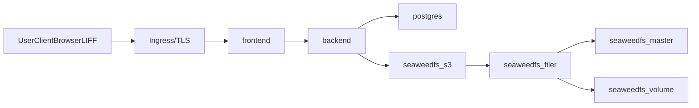
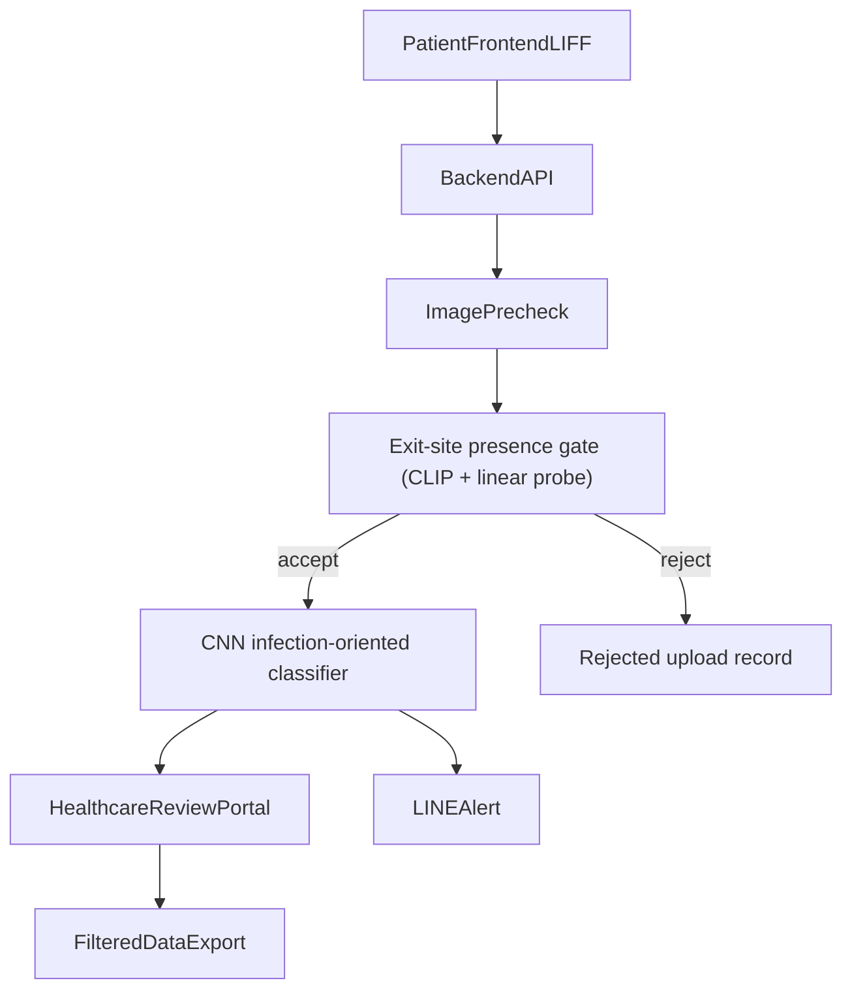

# PD Care Monorepo

PD Care is a peritoneal dialysis exit-site imaging and infection alert system. This repository contains the patient-facing frontend, backend API/inference services, PostgreSQL metadata storage, and SeaweedFS object-storage services that together power guided capture, AI screening, clinical review, and alert workflows.

## Related Repositories

- [Classification training repository](https://github.com/ruby0322/ntuh-pd-exit-site-classification)
- [Detection model training repository](https://github.com/ruby0322/ntuh-pd-exit-site-detection)
- [Classification model repository](https://huggingface.co/ruby0322/pd-exit-site-classification)
- [Detection model repository](https://huggingface.co/ruby0322/pd-exit-site-clip-linear-probe)


## Table of Contents

- [1) Functions / Features](#section-1-functions-features)
- [2) System Architecture](#section-2-system-architecture)
- [3) Project Startup](#section-3-project-startup)
- [4) Deployment Notes](#section-4-deployment-notes)

<a id="section-1-functions-features"></a>
## 1) Functions / Features

### Product Objective

- Standardize exit-site image capture quality for peritoneal dialysis patients.
- Provide AI-assisted infection risk alerts while keeping diagnosis and treatment decisions with physicians.
- Build a reviewable image database for care follow-up and research.

### Role-Based Functions

| Role | Function Scope | Key Requirements |
|------|----------------|------------------|
| Patient | Capture images and receive guidance/alerts | Guided UI, alignment prompts, image upload |
| Healthcare staff | Review image history and model outputs | Filtering/sorting, detail review, manual annotation, follow-up tracking |
| Backend admin | Operate and maintain platform services | User management, model versioning, data access control |

### Core Workflow Features

- **Patient-side guided capture**
  - Single-step image capture with on-screen guidance (lighting, exit-site alignment, catheter-line visibility).
- **Backend validation and AI pipeline**
  - Preliminary image checks reject low-quality uploads with explicit reasons.
  - **Exit-site presence pre-screen** (optional): CLIP vision encoder + sklearn **linear classifier** (logistic-style probe on frozen embeddings) gates whether an upload is treated as exit-site imagery for screening. Frames that fail the gate are persisted as **rejected** with an explicit reason so random or off-topic photos do not run infection inference. Inference errors on this step **fail open** so screening still proceeds if the probe cannot run.
  - **CNN multiclass classifier** produces the guided-capture pathology labels used for suspected-infection alerting (distinct from presence pre-screening).
- **Clinical review workflow**
  - Healthcare staff review upload history, model outputs, rejected reasons, and follow-up status.
  - Filtered/sorted table workflows and export support operational monitoring.
- **Follow-up communication**
  - `LINEAlert` notification channel sends guidance alerts for suspected cases.
  - Alert messages are assistive only and do not constitute diagnosis.

<a id="section-2-system-architecture"></a>
## 2) System Architecture

PD Care currently supports two runtime topologies:

- **Local compose topology** for integrated development and host-level operations (`docker-compose.yml`).
- **Kubernetes topology** for `pd-care-dev` and `pd-care-prod` namespaces (see `k8s/` overlays + runbooks).

### Microservice Topology and Relationships

- `frontend` is the user-facing web app and depends on a healthy `backend`.
  - In Compose, `frontend` also terminates HTTPS directly on host `:443`.
  - In Kubernetes, ingress routes `/` to `frontend`; API traffic uses frontend rewrite (`/api/*` → backend `/*`, e.g. `/api/v1/...` → `/v1/...`).
- `backend` provides API, inference, and workflow logic, and depends on healthy `postgres` and `seaweedfs-s3`.
- SeaweedFS object storage is composed as:
  - `seaweedfs-s3 -> seaweedfs-filer -> (seaweedfs-master + seaweedfs-volume)`.
- Persistence responsibilities:
  - `postgres` stores structured metadata and workflow records.
  - SeaweedFS S3-compatible endpoint stores image assets and related binary objects.
- Kubernetes injects sensitive runtime values through per-namespace secret `pd-care-secrets` (`k8s/overlays/*/secret.yaml`, gitignored).

### Compose Service Flow



### Kubernetes Topology (Dual Namespace)

On the operator host, DNS points at the public NIC; the ingress bridge forwards host `:443` and `:80` to Minikube ingress NodePorts. TLS is managed by cert-manager. See [`docs/architecture/platform.md`](docs/architecture/platform.md) for the current platform diagram and delivery path.

### Clinical Inference and Alert Flow



When pre-screen is **disabled**, or inference **throws**, the backend **does not reject** uploads on this gate (fail-open toward infection screening).

### Component Planning Focus

- **Exit-site presence pre-screen**: CLIP image features + sklearn linear classifier; configurable via `PRESCREEN_*` env (see compose / `apps/backend` config). Separate from pathology classification.
- `LINEAlert`: downstream notification component triggered by screening outcomes.

<a id="section-3-project-startup"></a>
## 3) Project Startup

### Quick Start (Application Development)

Start the frontend and backend together from the repository root:

```bash
npm run dev
```

The root `npm run dev` command starts both servers at the same time and prefixes log lines with color-coded `FRONTEND` and `BACKEND` labels.

### Quick Start (Compose Stack)

```bash
npm run docker:up
```

Compose brings up `frontend`, `backend`, `postgres`, and SeaweedFS services. By default:

- HTTPS app: `https://localhost` (host `:443`) — requires host TLS certs under `/etc/letsencrypt/live/<LETSENCRYPT_DOMAIN>/` (see TLS note below); for local dev without certs, use `npm run dev` instead
- Backend API: `http://localhost:8000`
- Postgres: `127.0.0.1:5432`
- SeaweedFS S3: `http://localhost:8333`

### Quick Start (Kubernetes / Minikube)

For dual-namespace deployment (`pd-care-dev`, `pd-care-prod`), use:

- [`docs/README.md`](docs/README.md) — documentation index
- `docs/deploy/k8s-minikube.md` for full deploy + verify flow
- `docs/deploy/k8s-domain-handover.md` for DNS/TLS cutover
- `docs/deploy/k8s-migration.md` for data migration

### Root Commands

```bash
npm run dev:frontend
npm run dev:backend
npm run dev
npm run build
npm run lint
npm run test
npm run docker:up
npm run docker:down
```

For scoped compose updates:

```bash
npm run docker:up:frontend
npm run docker:up:backend
npm run docker:up:obs
```

### Git Hooks (Husky)

After `npm install` at the repository root, Husky installs Git hooks automatically.

- `pre-commit` runs `npm run lint`
- `pre-push` runs `npm run lint`

If you need to bypass hooks for an emergency commit or push, use `--no-verify`.

### GitHub Actions CI

The repository runs validation CI in [`.github/workflows/ci.yml`](.github/workflows/ci.yml) on pull requests and pushes to `main`.

Validation CI scope is intentionally narrow and fast:

- `npm run lint` (frontend eslint + migration policy check)
- backend tests (`npm run test:backend`)
- frontend unit tests (`npm --prefix apps/frontend run test:unit -- --ci`)
- frontend build (`npm --prefix apps/frontend run build`)
- K8s overlay render checks (`kubectl kustomize k8s/overlays/dev|prod`)

Separate CD workflows handle image build and GitOps promotion:

- dev auto-delivery (after successful CI): [`.github/workflows/cd-build-dev.yml`](.github/workflows/cd-build-dev.yml)
- prod git-based promotion: [`.github/workflows/cd-promote-prod.yml`](.github/workflows/cd-promote-prod.yml)
- runbook: [`docs/deploy/argocd-cd.md`](docs/deploy/argocd-cd.md)

### Repository Layout

```text
apps/
  backend/   FastAPI inference API
  frontend/  Next.js application
docs/        Product, architecture, deploy runbooks, backlog
docker-compose.yml
package.json
README.md
```

### Applications

#### Frontend

The frontend is a Next.js app for patient capture and the broader PD Care web experience.

- Runs locally at `http://localhost:3000`
- Supports local API configuration through `NEXT_PUBLIC_API_BASE_URL`
- Uses the monorepo root scripts or `apps/frontend` scripts for development

`NEXT_PUBLIC_API_BASE_URL` guidance:

- Local direct backend access: `http://localhost:8000`
- Reverse-proxy / same-origin production (recommended): `/api`
- External dedicated API domain: `https://api.example.com`

Start from the monorepo root:

```bash
npm run dev:frontend
```

Or run it directly:

```bash
cd apps/frontend
npm install
npm run dev
```

#### Backend

The backend is a FastAPI inference service that serves the production PyTorch checkpoint and exposes screening endpoints.

- Accepts `multipart/form-data` image uploads
- Downloads the model on startup when `MODEL_PATH` is missing
- Uses a CPU-only inference runtime (`DEVICE=cpu`)
- Includes health and readiness probes
- Returns both multiclass probabilities and binary infection screening output

Local development:

```bash
cd apps/backend
python3 -m venv .venv
source .venv/bin/activate
python3 -m pip install --upgrade pip
python3 -m pip install -r requirements-dev.txt
cp .env.example .env
set -a
. ./.env
set +a
python3 -m alembic -c alembic.ini upgrade head
python3 -m uvicorn app.main:app --reload
```

Important backend environment variables:

- `MODEL_URL`: checkpoint download URL
- `MODEL_PATH`: local checkpoint path
- `DEVICE`: must be `cpu` (GPU support is intentionally disabled)
- `THRESHOLD`: infection screening threshold
- `MAX_UPLOAD_MB`: maximum upload size
- `MODEL_BACKBONE`: fallback backbone for `state_dict` reconstruction
- `MODEL_ARCH`: fallback architecture when `MODEL_BACKBONE=none`
- Presence pre-screen (optional): `PRESCREEN_ENABLED`, `PRESCREEN_MODEL_REPO_ID`, `PRESCREEN_MODEL_REVISION`, `PRESCREEN_REJECT_REASON`, `PRESCREEN_MODEL_CACHE_DIR`, plus `HF_TOKEN` when downloading the probe bundle from Hugging Face Hub

### Docker Compose

The root `docker-compose.yml` starts:

- `frontend` on `https://localhost` (host port `443`) — requires Let's Encrypt certs on the host (not zero-config)
- `backend` on `http://localhost:8000`
- `postgres` on `127.0.0.1:5432` by default (override bind/port with `PDCARE_POSTGRES_PORT_BIND`)
- SeaweedFS S3 on `http://localhost:8333`

If Kubernetes is active on Minikube (docker driver) and production DNS points at the host, use the ingress bridge to forward host `:443` and `:80` to Minikube ingress NodePorts:

```bash
docker compose -f docker-compose.ingress-bridge.yml up -d
```

Both bridge services should stay running: `:443` for HTTPS traffic and `:80` for cert-manager HTTP-01 (automatic TLS issue and renewal). See [`docs/deploy/tls-renewal.md`](docs/deploy/tls-renewal.md).

PostgreSQL network access modes:

- **Local-only mode (default, recommended):**
  - `PDCARE_POSTGRES_PORT_BIND=127.0.0.1:5432`
  - Keep `PDCARE_POSTGRES_HBA_FILE` unset (Postgres uses data-directory default `pg_hba.conf`).
- **Controlled remote mode (exception only):**
  - Set an explicit host bind like `PDCARE_POSTGRES_PORT_BIND=0.0.0.0:5432`
  - Set `PDCARE_POSTGRES_HBA_FILE=/etc/pd-care/postgres/pg_hba.remote.conf`
  - Require host/cloud firewall allowlists before exposing `5432`
  - Validate exposure after startup (`docker ps --format '{{.Names}} {{.Ports}}' | awk '/postgres/'` and `./ops/security/postgres_audit.sh`)

Bring the full stack up with:

```bash
npm run docker:up
```

Or start a single service:

```bash
npm run docker:up:frontend
npm run docker:up:backend
```

The compose file does not require `apps/backend/.env`. Backend defaults are set in compose, and you can override them from your shell with `PDCARE_*` variables.

Object storage persistence notes:

- SeaweedFS data is persisted with Docker named volumes for `seaweedfs-master`, `seaweedfs-volume`, and `seaweedfs-filer`.
- `npm run docker:up` (and normal `docker compose down` without `-v`) preserves uploaded objects in named volumes.
- Avoid `docker compose down -v` unless you intentionally want to remove all persisted object-storage metadata and chunks.

To verify persistence across restarts:

```bash
npm run docker:up
# Upload a test image through the app/API
npm run docker:down
npm run docker:up
# Verify the same uploaded image is still retrievable
```

Common overrides:

- `PDCARE_POSTGRES_PASSWORD` (set in project root `.env`; keep this synchronized with `PDCARE_DATABASE_URL`)
- `PDCARE_DATABASE_URL`
- `PDCARE_POSTGRES_PORT_BIND` (defaults to `127.0.0.1:5432`; set `0.0.0.0:5432` only if you explicitly need remote DB access)
- `PDCARE_POSTGRES_HBA_FILE` (optional; defaults to in-data-dir `pg_hba.conf`, set to `/etc/pd-care/postgres/pg_hba.remote.conf` for controlled remote mode)
- `PDCARE_S3_ENDPOINT_URL`
- `PDCARE_S3_REGION`
- `PDCARE_S3_ACCESS_KEY`
- `PDCARE_S3_SECRET_KEY`
- `PDCARE_S3_BUCKET_NAME`
- `PDCARE_IMAGE_ACCESS_TOKEN_SECRET`
- `PDCARE_IMAGE_ACCESS_TOKEN_TTL_SECONDS`
- `PDCARE_PRESCREEN_ENABLED`, `PDCARE_PRESCREEN_MODEL_REPO_ID`, `PDCARE_PRESCREEN_MODEL_REVISION`, `PDCARE_PRESCREEN_REJECT_REASON`, `PDCARE_PRESCREEN_MODEL_CACHE_DIR`, `PDCARE_HF_TOKEN` (CLIP+logreg bundle and Hub access)

PostgreSQL persistence/auth note:

- PostgreSQL named volume data survives `npm run docker:down`, so changing `PDCARE_POSTGRES_PASSWORD` in compose does not rotate credentials for an already-initialized data directory.
- Recommended: keep a root `.env` file (ignored by git) with both `PDCARE_POSTGRES_PASSWORD` and `PDCARE_DATABASE_URL` so application and DB credentials are managed in one place.
- If backend startup fails with `password authentication failed for user "postgres"` while using persistent volumes, align credentials and DB state manually:

```bash
docker exec pd-care-postgres-1 sh -lc \
  "psql -U postgres -d postgres -c \"ALTER USER postgres WITH PASSWORD '<new-password>';\""
docker exec pd-care-postgres-1 sh -lc \
  "db_exists=\$(psql -U postgres -d postgres -tAc \"SELECT 1 FROM pg_database WHERE datname='pd_care'\"); \
  [ \"\$db_exists\" = \"1\" ] || psql -U postgres -d postgres -c \"CREATE DATABASE pd_care\""
```

- Adjust the password/database names in those commands to match your `PDCARE_DATABASE_URL`.
- Security operations helpers:
  - `./ops/security/collect_forensics.sh <case-id>` to capture DB/container evidence with hash manifest.
  - `./ops/security/postgres_audit.sh` for periodic IOC + exposure checks.
  - `./ops/security/postgres-incident-runbook.md` for the standardized incident workflow.

Frontend build-time overrides (`NEXT_PUBLIC_*`):

- `NEXT_PUBLIC_API_BASE_URL` (defaults to `/api`) — inlined at **image build** time; changing compose env without rebuilding `frontend` does not update client bundles
- `NEXT_PUBLIC_LIFF_ID` — also build-time; K8s dev/prod need separate image builds (see `docs/deploy/k8s-minikube.md` §9)
- `LETSENCRYPT_DOMAIN` (used to resolve cert/key under `/etc/letsencrypt/live/<domain>/`)
- `PDCARE_HTTPS_PORT` (defaults to `443` on the host)

TLS note:

- Compose frontend uses `apps/frontend/tls-gateway.cjs` and expects valid cert files mounted from host `/etc/letsencrypt`.
- If your certs are not present at the default domain path, set `LETSENCRYPT_DOMAIN` or provide your own TLS paths through env.

The default compose file uses `DEVICE=cpu` and the backend image is CPU-only.

If your host only has deprecated `docker-compose` v1 and you hit `KeyError: 'ContainerConfig'` while recreating containers, use the same fallback the npm scripts use:

```bash
docker-compose down --remove-orphans
docker-compose up --build
```

### Backend API

#### Health Endpoints

```bash
curl http://127.0.0.1:8000/healthz
curl http://127.0.0.1:8000/readyz
```

#### Predict

```bash
curl -X POST http://127.0.0.1:8000/v1/predict \
  -H "accept: application/json" \
  -F "file=@/path/to/image.jpg;type=image/jpeg"
```

Example response shape:

```json
{
  "predicted_class_index": 4,
  "predicted_class_name": "class_4",
  "predicted_probability": 0.97,
  "class_probabilities": [
    { "class_index": 0, "class_name": "class_0", "probability": 0.01 }
  ],
  "screening": {
    "infection_class_index": 4,
    "infection_class_name": "class_4",
    "infection_probability": 0.97,
    "threshold": 0.5,
    "is_infection_positive": true
  }
}
```

<a id="section-4-deployment-notes"></a>
## 4) Deployment Notes

- **Current production-like model**: Kubernetes in Minikube with separate `pd-care-dev` and `pd-care-prod` namespaces.
- **Ingress path model**: keep ingress frontend-only (`/`), and let frontend rewrite `/api/:path*` to backend.
- **Secrets handling**: never commit `k8s/overlays/*/secret.yaml`; use `*.example` templates and apply out-of-band.
- **Credential leakage response**: use `ops/security/rotate_k8s_secrets.sh` to rotate K8s app secrets and restart backend safely.

### Model Notes

**Infection-oriented classifier (multiclass backbone)** — production screening path:

- 5 output classes: `class_0` through `class_4`
- `class_4` is the infection-positive class
- preprocessing uses `Resize(384) -> CenterCrop(384) -> ToTensor() -> ImageNet normalize`

If a future checkpoint is exported as a plain `state_dict`, set `MODEL_BACKBONE` and related fallback environment variables correctly so the service can reconstruct the model before loading weights.

**Exit-site presence pre-screen (CLIP + linear probe)** — optional upload gate:

- Loads a Hugging Face **snapshot** (probe weights + bundle metadata such as CLIP checkpoint id and decision threshold); default repo id is set in `docker-compose.yml` (`ruby0322/pd-exit-site-clip-linear-probe`).
- At inference time the service embeds each image with **CLIP**, then applies the **sklearn linear probe** scored like logistic regression (`predict_proba` or `decision_function` fallback).
- Does **not** use a YOLO detector in the deployed patient-upload path for this gate. Separate **YOLO-based detection** experimentation and training live in [`ntuh-pd-exit-site-detection`](https://github.com/ruby0322/ntuh-pd-exit-site-detection) and are not described here as runtime dependencies for presence compliance unless you intentionally wire something else later.