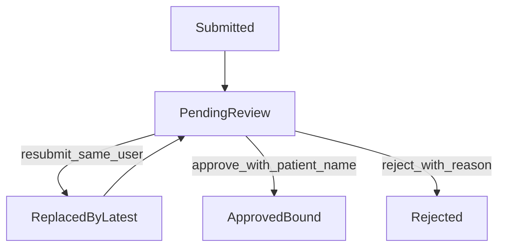
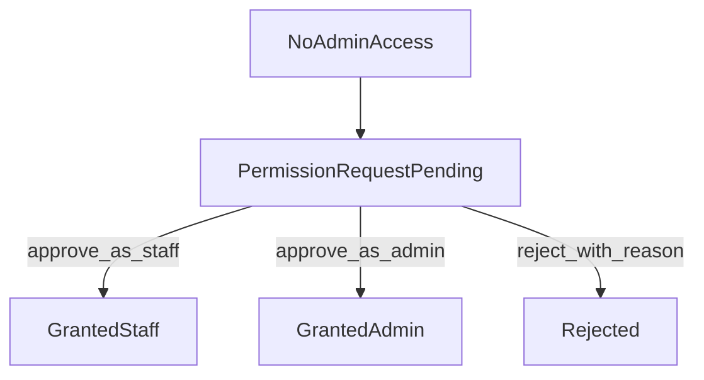

# Admin Dashboard PRD

## Document Purpose

This PRD defines the first production-ready admin dashboard scope for PD Care:

- Patient Review (`>=staff`)
- Patient Management (`>=staff`)
- User Management (`>=admin`)

It also defines a hard RBAC rule: `admin > staff > patient`, and all editing/authorization operations must enforce non-escalation and non-bypass behavior.

## Background And Problem

Current system already supports patient LINE login and pending binding, plus a staff dashboard baseline:

- Backend staff routes and authorization guards exist in `apps/backend/app/api/routes/staff.py`.
- Frontend admin dashboard and rapid review pages exist in `apps/frontend/app/admin/page.tsx` and `apps/frontend/app/admin/review/page.tsx`.
- Staff/admin auth behavior is validated in `apps/backend/tests/test_auth_staff_admin_api.py`.

Current gaps for operational use:

- Pending patient requests still need explicit productized review rules and rejection reason visibility.
- Patient management needs clear scope and assignment-limited visibility for staff.
- User management needs a complete admin-only authorization workflow, including healthcare privilege requests.
- Role boundaries must be explicit and verifiable at backend level for all write operations.

## Goals

- Enable manual review for unmatched users who submit case number and birth date.
- Enable staff to manage assigned patients safely and efficiently.
- Enable admins to manage user roles and account status.
- Enforce non-bypass RBAC for every mutation endpoint and admin UI path.

## Non-Goals

- Hospital SSO integration.
- Full compliance package and retention/legal policy expansion.
- Rich healthcare application forms (v1 uses one-click permission request).
- Realtime push notification delivery.
- Cross-hospital multi-tenant architecture.

## Personas And Role Boundaries

### Patient

- Can submit patient binding request (case number + birth date).
- Can submit healthcare-role request by clicking "我是醫護人員，請求權限" when blocked from admin surface.
- Cannot edit patient records, approve reviews, or assign roles.

### Staff

- Can review patient binding requests.
- Can create patient record during approval and bind applicant to newly created patient.
- Can manage assigned patients only.
- Cannot modify user roles or authorization level.

### Admin

- Has all staff capabilities.
- Can review healthcare-role requests.
- Can grant/revoke role and account status.
- Can assign `staff` or `admin` role through explicit review action.

## RBAC And Non-Overreach Enforcement

### Hard Rule

- Rank order is fixed: `admin > staff > patient`.
- Any authorization change requires actor rank strictly higher than target-operation rank.
- Any same-level or lower-level escalation attempt must fail.

### Allowed Operations By Role

- `patient`
  - submit own requests only.
- `staff`
  - patient review approve/reject.
  - patient profile edit and deactivate/reactivate for assigned patients.
  - no role/authorization change capabilities.
- `admin`
  - all `staff` operations.
  - user role assignment, healthcare request approval/rejection, account activate/suspend.

### Forbidden Operations (Hard Fail)

- `staff` calling any role or authorization mutation endpoint.
- non-admin modifying sensitive user authorization fields.
- any same-level or downward-bypass role grant path.
- any frontend-only gating without backend authorization recheck.

### API Enforcement Rules

- Every write endpoint re-verifies authorization server-side.
- Unauthorized response returns `403` with clear reason (hierarchy violation).
- Frontend hidden controls are never treated as security controls.

### Audit Enforcement Rules

For role and authorization mutations, persist audit event with:

- actor identity and actor role
- target identity
- action type
- before and after values
- timestamp
- rejection reason/approval reason when provided

## Feature Requirements

## 1) Patient Review (`>=staff`)

### User Story

As staff/admin, I can review unmatched user submissions so the user can become an active patient account if approved.

### Entry Conditions

- User logged in with LINE.
- User submitted `case_number` + `birth_date`.
- Submission validation checks required fields and format only.

### Main Flow

1. User submits request.
2. If the same user has pending request, system replaces previous pending request with latest submission.
3. Request appears in staff review queue.
4. Reviewer chooses approve or reject.
5. On approve:
   - reviewer inputs patient full name.
   - system creates patient record.
   - system binds requester identity to created patient.
   - user can use patient features directly without extra approval notice.
6. On reject:
   - reviewer must provide reject reason.
   - requester sees rejected state and reason.

### Error And Edge Cases

- Duplicate pending request from same user: replace previous pending record.
- Invalid payload format: return validation error.
- Reviewer authorization invalid: return `403`.
- Binding/create conflict: return actionable error and keep request pending.

### Acceptance Criteria

- Pending and rejected statuses are visible to requester.
- Reject reason is visible to requester.
- Approved requester can use patient flow immediately.
- Staff/admin can process requests; patient cannot.
- Replacement policy for repeated submission is deterministic and auditable.

## 2) Patient Management (`>=staff`)

### User Story

As staff/admin, I can search and manage patient records needed for clinical operations.

### Scope In v1

- list/search/filter by name, case number, status.
- patient detail view.
- edit patient basic profile (name, birth date, contact fields if enabled).
- deactivate/reactivate patient.

### Visibility Constraint

- staff sees assigned patients only.
- admin can see all patients.

### Error And Edge Cases

- staff attempting to access non-assigned patient must receive forbidden/not-found policy response.
- inactive patient should be clearly marked in list and detail.
- edits on inactive patient follow explicit product policy (either blocked or restricted fields only).

### Acceptance Criteria

- Patient list supports configured filters and returns role-scoped dataset.
- Staff cannot read/update out-of-scope patient records.
- Admin can complete full patient management scope.
- Deactivate/reactivate action updates list/detail state consistently.

## 3) User Management (`>=admin`)

### User Story

As admin, I can manage user accounts and review healthcare permission requests safely.

### Scope In v1

- user list/search/filter.
- user create/manage baseline record.
- role assignment (`patient`/`staff`/`admin` by product policy).
- account activate/suspend.
- review "I am healthcare staff, request permission" requests.

### Healthcare Permission Request Flow (v1)

- Trigger: user without admin access clicks one button request.
- Form fields: none in v1 (one-click submit).
- Reviewer: admin only.
- Admin decision can assign `staff` or `admin`, or reject with reason.

### Error And Edge Cases

- staff attempting review/role assignment must receive `403`.
- duplicate pending permission requests from same user follow deterministic policy (recommended single active pending request).
- role mutation conflicts require explicit conflict response and no partial writes.

### Acceptance Criteria

- Only admin can perform role and authorization mutations.
- Staff tokens always fail role mutation endpoints with `403`.
- Admin can approve healthcare request and choose target role.
- Audit record exists for every role change and account status change.

## State Machines

## A. Patient Binding Review State Machine

State notes:

- `ReplacedByLatest` is an event-state to preserve audit trace.
- terminal states for a request record are `ApprovedBound` and `Rejected`.

## B. Healthcare Permission Request State Machine

State notes:

- Approval immediately updates effective role for subsequent sessions/token refresh policy.
- Rejection keeps user at previous role.

## API And Data Model Impact

## Backend API (Target Additions/Changes)

- Keep current staff dashboard endpoints in `apps/backend/app/api/routes/staff.py`.
- Add explicit user-management and permission-request endpoints under admin-guarded routes.
- Add/extend patient-review endpoints to support:
  - replace-latest pending behavior
  - approve-with-create-and-bind
  - reject-with-reason visibility

## Response Contract Expectations

- All role/authz write endpoints:
  - `403` for hierarchy violation.
  - clear machine-readable error code for RBAC violation.
- Review endpoints should return stable status enums and timestamps.

## Data Entities (Conceptual)

- `pending_binding_request`
  - requester identity
  - case number
  - birth date
  - status
  - reject reason
  - replaced_by / replaced_at
- `healthcare_permission_request`
  - requester identity
  - status
  - decision role
  - reject reason
  - decided_by / decided_at
- `audit_event`
  - actor, target, action, before, after, reason, timestamp

## UI Scope (Admin Dashboard)

### Dashboard Navigation

- Keep current dashboard and rapid-review areas.
- Add explicit Patient Management and User Management sections.

### Patient Review UI

- pending list includes submission metadata and current status.
- approve action requires entering patient name.
- reject action requires reject reason.

### Patient Management UI

- searchable patient list.
- detail page with editable fields.
- deactivate/reactivate controls with confirmation.
- visibility filtered by role and assignment.

### User Management UI

- searchable user list with role/status badges.
- healthcare permission request queue.
- admin-only controls for role assignment and account status.
- blocked controls for non-admin users (defense-in-depth only).

## Security, Audit, And Compliance Baseline

- backend-first authorization checks for every mutation.
- explicit rate limiting and abuse controls can be added later; not blocker for v1 release.
- immutable audit trail for authorization and status changes.
- reject reasons treated as sensitive operational notes and shown only to intended audience.

## Test Plan And Verification

## Authorization Tests (Mandatory)

- staff token calling any role-mutation endpoint returns `403`.
- patient token calling staff/admin endpoints returns `403`.
- admin token can perform role approval and status changes.

## Functional Tests (Mandatory)

- pending binding can be approved with patient creation + binding.
- reject reason persists and is visible to requester.
- repeated submission replaces previous pending request.
- staff patient list is assignment-scoped.

## Abuse/Bypass Tests (Mandatory)

- direct manual API calls cannot bypass UI restrictions.
- hidden/disabled frontend controls do not affect backend enforcement.

## Success Metrics

- median time from patient review submission to decision.
- healthcare permission request throughput and approval latency.
- unauthorized mutation attempt count blocked by backend.
- patient management operation success rate (edit/deactivate/reactivate).
- audit completeness rate for role/status mutations (target: 100%).

## Rollout Notes

- Phase 1: ship patient review hardening and RBAC enforcement.
- Phase 2: ship user management + healthcare permission request queue.
- Phase 3: add deeper audit tooling, reporting, and ops dashboards.
