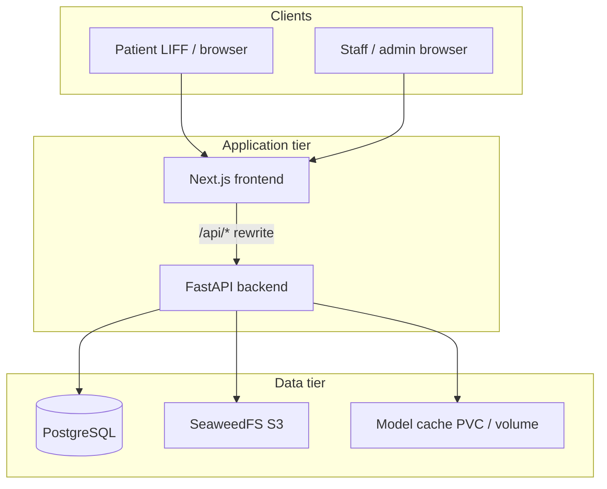

# Architecture documentation

Markdown architecture docs for the current PD Care monorepo. Product intent and
roadmap live in [`../product/`](../product/); operational runbooks in
[`../deploy/`](../deploy/).

| Doc | Scope |
| --- | --- |
| [`application.md`](application.md) | Clinical workflows, API surface, auth, AI pipeline, data model |
| [`platform.md`](platform.md) | Runtimes (Compose / K8s), ingress, TLS, GitOps CD, observability |

## At a glance

PD Care is a monorepo for peritoneal dialysis exit-site imaging: patients capture
photos via LINE LIFF; the backend stores metadata in PostgreSQL and images in
SeaweedFS; ML models screen uploads; staff review suspected cases in an admin UI.

**Production path today:** GitHub Actions builds images → GHCR → Argo CD syncs
`k8s/overlays/dev` and `k8s/overlays/prod` on a Minikube cluster with cert-manager
TLS and NGINX ingress.

## Repository map

| Path | Role |
| --- | --- |
| `apps/frontend/` | Next.js App Router (patient + `/admin`) |
| `apps/backend/` | FastAPI API, Alembic migrations, inference |
| `k8s/base/` | Shared K8s manifests (Kustomize) |
| `k8s/overlays/dev`, `k8s/overlays/prod` | Environment overlays and image tags |
| `k8s/argocd/` | Argo CD project and Applications |
| `k8s/cert-manager/` | ClusterIssuer and Certificate CRs |
| `ops/deploy/` | Bootstrap, verify, and operator scripts |
| `docker-compose.yml` | Local integrated stack |
| `docker-compose.observability.yml` | Prometheus / Loki / Grafana (Compose only) |

## Related docs

- [`../product/curated-prd.md`](../product/curated-prd.md) — product baseline
- [`../deploy/argocd-cd.md`](../deploy/argocd-cd.md) — CD runbook
- [`../backlog/README.md`](../backlog/README.md) — deferred work
