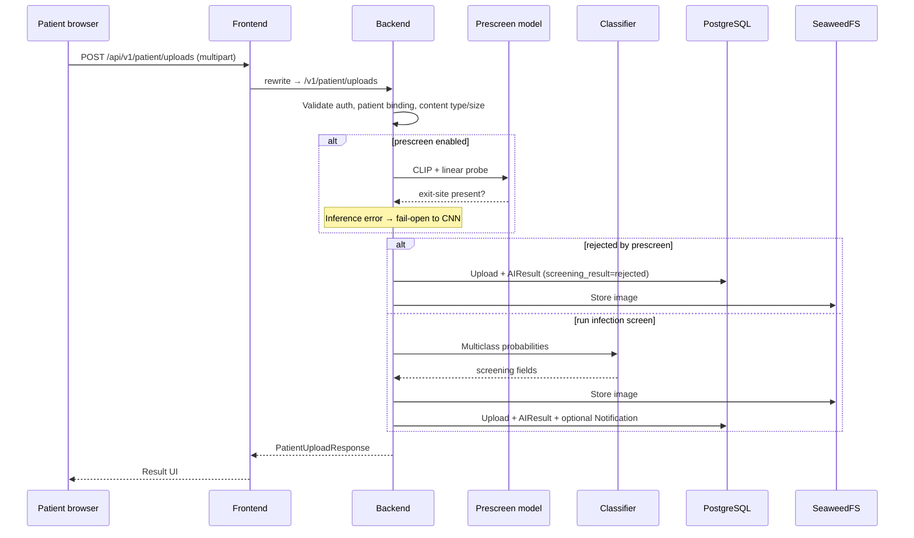
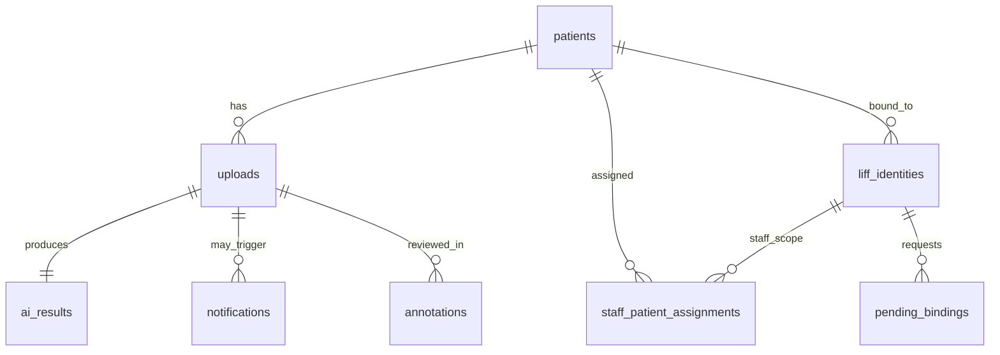

# Application architecture

How PD Care's clinical software is structured: clients, APIs, persistence, and
the AI screening pipeline.

## Roles and surfaces

| Role | UI entry | Auth |
| --- | --- | --- |
| Patient | `/patient/*` (LIFF) | LINE identity → backend JWT |
| Staff | `/admin/*` | Staff LINE login or built-in pilot identities → JWT |
| Admin | `/admin/*` (elevated RBAC) | Same as staff with `admin` role |

RBAC rule: `admin > staff > patient`. Staff endpoints enforce role and patient
assignment scope; admins bypass assignment filters where documented in
[`admin-dashboard-prd.md`](../product/admin-dashboard-prd.md). Patient endpoints
(`/v1/patient/*`) are self-service only and resolve the target patient from the
authenticated identity's active binding (no client-selected `line_user_id`).

### Frontend (`apps/frontend`)

Next.js App Router with server/client components. Key route groups:

| Area | Routes | Purpose |
| --- | --- | --- |
| Patient | `/patient`, `/patient/capture`, `/patient/day/[date]`, `/patient/result`, `/patient/messages` | Guided capture, calendar, results, messages |
| Admin | `/admin`, `/admin/review`, `/admin/review-fast`, `/admin/history-overview`, `/admin/patients`, `/admin/users`, `/admin/patient-assignment`, `/admin/registration-review`, `/admin/monitoring` | Review queues, history KPIs, user and assignment management |

**API routing:** the frontend does not call the backend origin directly from the
browser for same-origin requests. `next.config.mjs` rewrites `/api/:path*` to
`BACKEND_INTERNAL_URL/:path*` (e.g. `/api/v1/patient/uploads` → `/v1/patient/uploads`).

Build-time env (`NEXT_PUBLIC_LIFF_ID`, `NEXT_PUBLIC_API_BASE_URL=/api`) is baked
into client bundles at `docker build` — separate images per environment on K8s.

### Backend (`apps/backend`)

FastAPI application (`app/main.py`) with route groups:

| Router | Prefix / tag | Responsibility |
| --- | --- | --- |
| `health` | `/healthz`, `/readyz` | Liveness / readiness |
| `auth` | `/v1/auth/*` | Staff login, token issuance |
| `identity` | `/v1/identity/*` | LIFF binding, pending bindings |
| `patient` | `/v1/patient/*` | Upload orchestration, history, image access |
| `staff` | `/v1/staff/*` | Review queues, annotations, admin, notifications |
| `predict` | `/v1/predict` | Low-level inference (unauthenticated dev/tooling endpoint) |

Startup loads SQLAlchemy engine, SeaweedFS `StorageService`, CNN classifier, and
optional prescreen model. Migrations run at startup unless `RUN_DB_MIGRATIONS=false`
(prod K8s pods; migrations run via PreSync Job instead).

## Request flow (patient upload)

Implementation: `app/services/upload.py` → `persist_patient_upload`.

### AI pipeline stages

| Stage | Model | Config | Outcome |
| --- | --- | --- | --- |
| Presence pre-screen (optional) | CLIP embeddings + sklearn linear probe | `PRESCREEN_*` env | `rejected` if not exit-site; **fail-open** on inference errors |
| Infection-oriented screen | CNN multiclass (PyTorch) | `MODEL_PATH`, `THRESHOLD`, class names | `suspected` or `normal` from infection class probability |
| Low-level API | Same CNN | `/v1/predict` | Direct probabilities; not the patient upload path |

`screening_result` values on `ai_results`: `normal`, `suspected`, `rejected`,
`technical_error`.

Suspected cases create a `notifications` row (`status=new`) for staff review.
This is an in-app / staff workflow signal; automatic LINE Messaging API push is
not part of the current backend path.

### Image access model

Clients never receive raw SeaweedFS URLs. The backend:

1. Writes objects with generated keys (`StorageService.store_image`).
2. Issues short-lived HMAC tokens for `` (`image_access_token_ttl_seconds`, default 300s).
3. Serves bytes through authenticated backend routes after token validation.

Staff and patient flows have separate token subjects and authorization checks.

## Data model (core entities)

PostgreSQL schema via SQLAlchemy + Alembic (`apps/backend/app/db/models.py`):

| Table | Purpose |
| --- | --- |
| `patients` | Clinical identity (case number + birth date unique) |
| `liff_identities` | LINE user ↔ patient/staff/admin role binding |
| `pending_bindings` | Patient self-registration awaiting staff approval |
| `staff_patient_assignments` | Staff visibility scope |
| `uploads` | Image metadata + symptom flags |
| `ai_results` | Model output and screening_result |
| `notifications` | Staff alert queue for suspected uploads |
| `annotations` | Staff labels and comments on uploads |
| `healthcare_access_requests` | Access elevation workflow |
| `authorization_audit_events` | RBAC audit trail |

Object storage: private SeaweedFS bucket; only `object_key` stored in Postgres.

## Staff workflows (implemented)

- **Review queues** — filter suspected uploads, rapid review grids.
- **History overview** — day-level KPIs and calendar ([`history-overview-api-contract.md`](../product/history-overview-api-contract.md)).
- **Patient management** — roster and per-patient upload history.
- **User / assignment admin** — roles, staff–patient assignments, registration review.
- **Notifications** — staff notification bell and mark-read flows.

## Security boundaries

- All clinical image reads go through the backend with auth + short-lived tokens.
- Secrets (`pd-care-secrets`, LIFF channel, DB, S3 keys) are injected per
  environment; K8s secret manifests are gitignored.
- CORS and bearer JWT validation on protected routes (`app/api/deps/auth.py`).
- Pilot allowlists (`PILOT_ADMIN_IDENTITY_IDS`, `PILOT_STAFF_IDENTITY_IDS`) exist
  in Compose; K8s parity is a tracked backlog item ([K8S-001](../backlog/k8s-infrastructure.md#k8s-001-compose-env-parity)).

## Testing and quality gates

- Backend: `pytest` under `apps/backend/tests/` (API, auth, upload, staff dashboards).
- Frontend: ESLint + Vitest unit tests under `apps/frontend/`.
- CI (`.github/workflows/ci.yml`): lint, backend tests, frontend tests, frontend build, `kubectl kustomize` render on PR/push to `main`.
