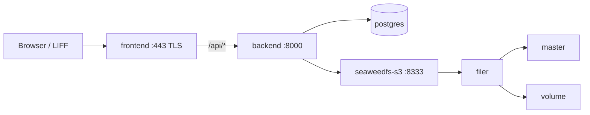
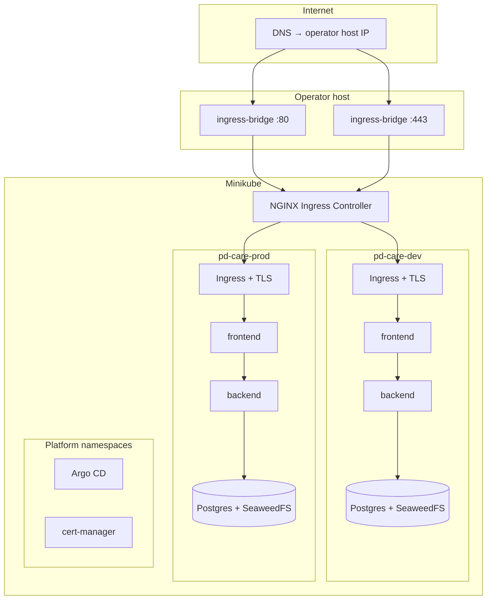
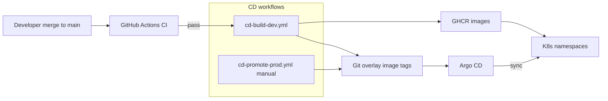

# Platform architecture

Runtime topologies, networking, delivery pipeline, and platform services that
host the PD Care application.

## Runtime topologies

PD Care supports two active topologies:

| Topology | Use | Entry |
| --- | --- | --- |
| **Docker Compose** | Local dev, integrated testing, observability stack | `docker-compose.yml`, `npm run dev` |
| **Kubernetes (Minikube)** | Dev + prod namespaces on operator host | `k8s/overlays/*`, [`k8s-minikube.md`](../deploy/k8s-minikube.md) |

Compose and K8s are **not** meant to serve the same public `:443` simultaneously;
after cutover the ingress bridge owns host HTTPS.

### Compose stack

Services: `postgres`, SeaweedFS chain (`master` → `volume` → `filer` → `s3`),
`backend`, `frontend`. Optional `docker-compose.observability.yml` adds
Prometheus, Loki, Promtail, Grafana on a separate Compose network
([`observability.md`](../ops/observability.md)).

### Kubernetes dual namespace

Two isolated namespaces share one NGINX Ingress Controller on the Minikube cluster:

| Namespace | Host | Purpose |
| --- | --- | --- |
| `pd-care-dev` | `test.pd.lu.im.ntu.edu.tw` | Test / staging |
| `pd-care-prod` | `pd.lu.im.ntu.edu.tw` | Production pilot |

Each namespace runs a full copy of the app stack from `k8s/base/`:

- `frontend` Deployment + Service (port 3000)
- `backend` Deployment + Service (port 8000)
- `postgres` StatefulSet + PVC
- SeaweedFS Deployments + PVCs (master, volume, filer, s3)
- `model-cache` PVC for backend inference artifacts
- Ingress (TLS secret per host)

**Prod hardening** (`k8s/overlays/prod/`):

- Frontend and backend `replicas: 2`, rolling update `maxUnavailable: 0`
- `PodDisruptionBudget` on backend
- `RUN_DB_MIGRATIONS=false` on backend pods; Alembic via PreSync `migrate-job`
- GHCR image tags promoted by CD workflows

### Ingress and TLS

**Path routing (app namespaces):** Ingress sends `/` to `frontend:3000`. API traffic
is **not** routed at ingress; the frontend rewrites `/api/*` to the backend Service.

**Host bridge:** `docker-compose.ingress-bridge.yml` publishes Minikube ingress
NodePorts on the host public NIC:

- `:443` → ingress HTTPS (app + Argo CD UI)
- `:80` → ingress HTTP (ACME HTTP-01 challenges)

**TLS:** cert-manager (`k8s/cert-manager/`) issues Let's Encrypt certificates into
per-namespace TLS Secrets. Renewal is automatic in-cluster
([`tls-renewal.md`](../deploy/tls-renewal.md)). Manual certbot sync is deprecated.

| Host | TLS secret namespace |
| --- | --- |
| `test.pd.lu.im.ntu.edu.tw` | `pd-care-dev` |
| `pd.lu.im.ntu.edu.tw` | `pd-care-prod` |
| `argocd.pd.lu.im.ntu.edu.tw` | `argocd` |

## Platform layer (bootstrap)

These components are installed by `ops/deploy/bootstrap-argocd-cd.sh`, not managed
by the pd-care Argo Applications:

| Component | Install | Day-2 |
| --- | --- | --- |
| Argo CD | Upstream stable manifest | Manual upgrade / re-bootstrap |
| cert-manager controller | Upstream manifest | In-cluster cert renewal |
| `k8s/cert-manager/` CRs | `kubectl apply -k` | Git truth; no Argo sync yet |
| Argo CD ingress + cmd-params | Bootstrap apply | Same |

Argo CD UI: `https://argocd.pd.lu.im.ntu.edu.tw` or local port-forward
([`argocd-dashboard.md`](../deploy/argocd-dashboard.md)).

Future GitOps for platform manifests: [PLAT-001](../backlog/platform-gitops.md#plat-001-pd-care-platform-argo-application).

## Delivery pipeline (GitOps CD)

| Stage | Workflow | Behavior |
| --- | --- | --- |
| Verify | `ci.yml` | Lint, backend + frontend tests, frontend build, kustomize render |
| Dev CD | `cd-build-dev.yml` on push to `main` | Build/push `dev-sha-*` / `sha-*` tags; commit tag bump to `k8s/overlays/dev` |
| Prod promote | `cd-promote-prod.yml` (workflow_dispatch) | Copy dev tags to prod overlay (`prod-sha-*`); Argo syncs prod |
| Deploy | Argo CD | `pd-care-dev` auto-sync; `pd-care-prod` syncs after git promotion |
| Schema | PreSync `migrate-job` (prod) | Alembic upgrade before backend rollout |

Repository: public `ruby0322/pd-care-monorepo` (no Git PAT for Argo clone).
GHCR pull uses `ghcr-pull-secret` per namespace when packages are private.

Details: [`argocd-cd.md`](../deploy/argocd-cd.md).

## Configuration and secrets

| Layer | Non-secret config | Secrets |
| --- | --- | --- |
| K8s | `k8s/base/configmap.yaml` + overlay patches | `k8s/overlays/*/secret.yaml` (gitignored, from `.example`) |
| Compose | `.env`, `docker-compose.yml` env | Same keys, host `.env` |
| Frontend build | `NEXT_PUBLIC_*` at image build | N/A (inlined in bundle) |

Overlay examples document required keys: DB URL, S3 credentials, auth secrets,
LINE channel, optional `HF_TOKEN` for private model download.

## Observability (current state)

| Signal | Compose | K8s |
| --- | --- | --- |
| Prometheus metrics | Scrapes `backend:8000` on Compose network | Not deployed |
| Loki logs | Promtail → Loki | Not deployed |
| Grafana | `/grafana` via frontend rewrite | Broken until migrated ([PROD-001](../backlog/product.md#prod-001-observability-on-kubernetes)) |
| Backend `/metrics` | Available when Prometheus configured | Available per-pod; no cluster scrape config |

## Persistence and migration

- **Compose → K8s data move:** [`k8s-migration.md`](../deploy/k8s-migration.md)
- **Prod rolling upgrades:** [`k8s-zero-downtime-rollout.md`](../deploy/k8s-zero-downtime-rollout.md)
- **Authority rule:** active production data lives in whichever topology is serving
  traffic (Compose volumes vs `pd-care-prod` PVCs) — do not dual-write.

## Deferred platform items

Tracked in [`backlog/`](../backlog/README.md): Compose env parity on K8s, real-cluster
GPU/registry hardening, observability on K8s, cert-manager version pin, platform
Argo Application.
