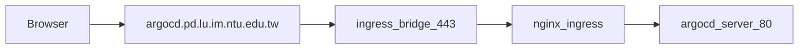

# Argo CD Dashboard Access

Argo CD ships with a web UI for sync status, diffs, logs, and rollbacks. The
controller installs `argocd-server` as **ClusterIP** (no NodePort), so
`minikube service argocd-server` does not provide a URL. Use port-forward for
operator access on the host running `kubectl`.

See also: [argocd-cd.md](argocd-cd.md) for GitOps delivery; [k8s-minikube.md](k8s-minikube.md)
for app ingress (separate from Argo CD).

## Phase 1 — Port-forward (internal)

For internal / operator use on the machine that runs `kubectl` (or via SSH tunnel).
Works without DNS or cert-manager setup.

### Quick start

```bash
bash ops/deploy/argocd-ui-portforward.sh
```

Open **http://127.0.0.1:8080** (or **https://** only when `server.insecure` is not set on
`argocd-cmd-params-cm`; after Phase 2 ingress setup the script auto-selects HTTP on port 80).

Override the local port:

```bash
ARGOCD_UI_LOCAL_PORT=9443 bash ops/deploy/argocd-ui-portforward.sh
```

### Login

| Field | Value |
| --- | --- |
| Username | `admin` |
| Password | From `argocd-initial-admin-secret` (printed by the script if present) |

Fetch password manually:

```bash
kubectl -n argocd get secret argocd-initial-admin-secret \
  -o jsonpath='{.data.password}' | base64 -d && echo
```

**Rotate the password** after first login: Argo CD UI → User Info → Update Password.

### Manual port-forward

Equivalent to the helper script:

```bash
# Forwards service port 80 (HTTP) when server.insecure is true, else 443 (HTTPS).
kubectl port-forward svc/argocd-server -n argocd 8080:80   # after Phase 2
# kubectl port-forward svc/argocd-server -n argocd 8080:443  # before cmd-params patch
```

### Remote operator (SSH tunnel)

From your laptop when the cluster is on a remote host:

```bash
ssh -L 8080:127.0.0.1:8080 user@operator-host
# On operator host (separate session): bash ops/deploy/argocd-ui-portforward.sh
```

Then open **http://127.0.0.1:8080** on the laptop (use `http` after Phase 2 `server.insecure`).

### What you can do in the UI

- View `pd-care-dev` and `pd-care-prod` sync / health / Git revision
- Sync, refresh, and diff against `main`
- Inspect resources (pods, jobs, ingress) and hook status (e.g. `backend-migrate`)
- View pod logs (basic)

CLI and [`verify-argocd-cd.sh`](../../ops/deploy/verify-argocd-cd.sh) remain useful
for scripts and automation.

### Troubleshooting

| Symptom | Likely cause | Action |
| --- | --- | --- |
| `argocd-server not found` | Argo CD not installed | `bash ops/deploy/bootstrap-argocd-cd.sh` |
| Connection refused on `:8080` | Port-forward not running | Start `argocd-ui-portforward.sh` in a dedicated terminal |
| `minikube service` shows no URL | Service is ClusterIP | Expected; use port-forward (this doc) |
| Login fails | Wrong or rotated password | Reset via `argocd` CLI or delete `argocd-initial-admin-secret` only on fresh installs |

---

## Phase 2 — Ingress + TLS (external)

**Hostname:** `https://argocd.pd.lu.im.ntu.edu.tw`

Uses the same nginx ingress + ingress-bridge stack as prod/dev ([`k8s-minikube.md`](k8s-minikube.md) §2.1).
Manifests live in [`k8s/argocd/`](../../k8s/argocd/) (platform layer, not dev/prod overlays).



| Item | Value |
| --- | --- |
| Ingress | [`k8s/argocd/ingress.yaml`](../../k8s/argocd/ingress.yaml) |
| Server config | [`k8s/argocd/cmd-params-patch.yaml`](../../k8s/argocd/cmd-params-patch.yaml) (`server.insecure`, external `url`) |
| TLS secret | `argocd-pd-lu-im-ntu-edu-tw-tls` in `argocd` namespace (operator-created) |

### One-time operator setup

1. **DNS** — `argocd.pd.lu.im.ntu.edu.tw` A record → operator host public IP (same as prod).

2. **cert-manager** — install once and ensure controllers are ready:

   ```bash
   kubectl apply -f https://github.com/cert-manager/cert-manager/releases/latest/download/cert-manager.yaml
   kubectl -n cert-manager rollout status deploy/cert-manager --timeout=300s
   kubectl -n cert-manager rollout status deploy/cert-manager-webhook --timeout=300s
   kubectl -n cert-manager rollout status deploy/cert-manager-cainjector --timeout=300s
   ```

3. **Issuer + Certificate**:

   ```bash
   kubectl apply -k k8s/cert-manager
   kubectl wait --for=condition=Ready certificate/argocd-pd-lu-im-ntu-edu-tw -n argocd --timeout=300s
   ```

4. **Apply** (or re-run bootstrap):

   ```bash
   kubectl apply -f k8s/argocd/cmd-params-patch.yaml
   kubectl apply -f k8s/argocd/ingress.yaml
   kubectl -n argocd rollout restart deploy/argocd-server
   kubectl -n argocd rollout status deploy/argocd-server --timeout=300s
   ```

   Or: `bash ops/deploy/bootstrap-argocd-cd.sh` (installs cert-manager, applies certificates, cmd-params, and ingress).

5. **Verify**:

   ```bash
   curl -fsS https://argocd.pd.lu.im.ntu.edu.tw/healthz
   ```

   Without public DNS yet, test via minikube IP:

   ```bash
   INGRESS_IP="$(minikube ip)"
   curl -kI --resolve argocd.pd.lu.im.ntu.edu.tw:443:${INGRESS_IP} \
     https://argocd.pd.lu.im.ntu.edu.tw/
   ```

### Cert renewal

cert-manager renews the Argo CD TLS secret automatically. Watch with:

```bash
kubectl get certificate argocd-pd-lu-im-ntu-edu-tw -n argocd
kubectl describe certificate argocd-pd-lu-im-ntu-edu-tw -n argocd
```

### Security

- Rotate `admin` password before sharing the external URL (Phase 1 login flow).
- Do not expose the UI with the default `argocd-initial-admin-secret` password.
- Optional later: OIDC / GitHub SSO via `argocd-cm`.

Phase 1 port-forward remains available when the ingress-bridge is down or for local debugging.
