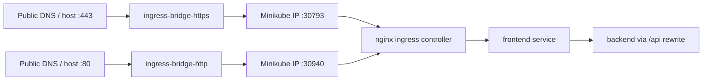

# PD Care K8s (Minikube) Runbook

This runbook provides a minimal, maintainable Kubernetes workflow for two namespaces:

- `pd-care-dev`
- `pd-care-prod` (prod-like, still inside Minikube)

**Preferred delivery path:** GitOps via Argo CD and GHCR image tags. The source
repository (`ruby0322/pd-care-monorepo`) is **public**, so Argo CD does not need
a Git PAT. See [`argocd-cd.md`](argocd-cd.md) for CI/CD promotion, `ghcr-pull-secret`
setup, and the end-to-end dry-run checklist. For the Argo CD web UI, see
[`argocd-dashboard.md`](argocd-dashboard.md) (port-forward or `argocd.pd.lu.im.ntu.edu.tw`).

The sections below still document manual Minikube operations (local image builds,
`kubectl apply`, scoped rollouts). Overlays now reference `ghcr.io/ruby0322/...` with
`ghcr-pull-secret`. Pull policy: **dev** uses `IfNotPresent` (overlay patch); **prod**
uses `Always` (base). Manual deploys require either:

- following the Argo CD path in [`argocd-cd.md`](argocd-cd.md), or
- creating `ghcr-pull-secret` in the target namespace and using the GHCR tags from
  `k8s/overlays/*/kustomization.yaml`.

## 1) Prerequisites

- Minikube installed and running
- `kubectl` installed
- `docker` installed

Start Minikube and enable ingress:

```bash
minikube start
minikube addons enable ingress
```

Use Minikube's Docker daemon so local images are available to pods:

```bash
eval "$(minikube docker-env)"
```

Build images used by manifests (both frontend tags are required before applying dev and prod overlays):

```bash
# Prod namespace (pd-care-prod)
docker build -t pd-care-frontend:latest \
  --build-arg NEXT_PUBLIC_API_BASE_URL=/api \
  --build-arg NEXT_PUBLIC_LIFF_ID=1657724367-uzPg8SgK \
  ./apps/frontend

# Dev namespace (pd-care-dev) — separate tag and LIFF ID
docker build -t pd-care-frontend:dev \
  --build-arg NEXT_PUBLIC_API_BASE_URL=/api \
  --build-arg NEXT_PUBLIC_LIFF_ID=1657724367-B0JCWwiu \
  ./apps/frontend

# Backend image now bakes checkpoint + prescreen + CLIP cache into /models at build time.
# Optional: export HF_TOKEN when private Hub access or rate limits require auth.
docker build -t pd-care-backend:latest ./apps/backend
```

## 2) Domain and DNS prerequisites

Target domains:

- prod-like namespace (`pd-care-prod`): `https://pd.lu.im.ntu.edu.tw`
- test namespace (`pd-care-dev`): `https://test.pd.lu.im.ntu.edu.tw`

Ingress hosts are already set in overlays:

- [`k8s/overlays/prod/patch-ingress.yaml`](../../k8s/overlays/prod/patch-ingress.yaml)
- [`k8s/overlays/dev/patch-ingress.yaml`](../../k8s/overlays/dev/patch-ingress.yaml)

What the administrator must do (no sudo needed from your side):

1. Point DNS records to the operator host public IP (same host that runs minikube).
   - `pd.lu.im.ntu.edu.tw` — required for production
   - `test.pd.lu.im.ntu.edu.tw` — required for dev; site returns 200 via ingress when resolved to the host IP
2. Install cert-manager and apply `k8s/cert-manager` resources (next section).
3. Start the ingress bridge (minikube docker driver does not bind :443/:80 on the public NIC):

```bash
docker compose -f docker-compose.ingress-bridge.yml up -d
```

See [`docker-compose.ingress-bridge.yml`](../../docker-compose.ingress-bridge.yml).

### 2.1) Ingress architecture (two layers)

`minikube addons enable ingress` and `docker-compose.ingress-bridge.yml` are **not** the same thing. They work together:

| Layer | What it is | Role |
| --- | --- | --- |
| **Ingress addon** | nginx ingress controller inside Minikube | Reads `Ingress` manifests, routes by host (`test.pd...` vs `pd...`), terminates TLS, forwards to cluster services |
| **Ingress bridge** | host-network `socat` containers ([`docker-compose.ingress-bridge.yml`](../../docker-compose.ingress-bridge.yml)) | Publishes ingress on the host public NIC: `host:443` → Minikube HTTPS NodePort; `host:80` → HTTP NodePort (ACME HTTP-01) |

With the Minikube **docker** driver, ingress listens on the Minikube VM IP (for example `192.168.49.2`), not on the host's public interface. DNS points at the host, so the bridge is required for browsers to reach K8s ingress.



Default bridge targets (override with env vars in the compose file):

- `MINIKUBE_IP` — from `minikube ip` (default `192.168.49.2`)
- `INGRESS_HTTPS_NODEPORT` — from `kubectl get svc -n ingress-nginx ingress-nginx-controller` (default `30793`)
- `INGRESS_HTTP_NODEPORT` — same Service, port 80 (default `30940`)

Confirm NodePorts before starting the bridge:

```bash
minikube ip
kubectl get svc -n ingress-nginx ingress-nginx-controller -o jsonpath='{.spec.ports[?(@.port==443)].nodePort}{"\n"}'
kubectl get svc -n ingress-nginx ingress-nginx-controller -o jsonpath='{.spec.ports[?(@.port==80)].nodePort}{"\n"}'
```

**Keep both `:80` and `:443` bridged** while cert-manager manages TLS. HTTP-01 renewal requires public reachability on `:80` through this path.

**Do not run both** the ingress bridge and Docker Compose `frontend` on host `:443` at the same time — only one process can listen on that port. After K8s cutover, stop Compose HTTPS routing (see §6) and keep the bridge.

## 3) TLS certificates for ingress (cert-manager)

Install cert-manager once as a platform dependency:

```bash
kubectl apply -f https://github.com/cert-manager/cert-manager/releases/latest/download/cert-manager.yaml
kubectl -n cert-manager rollout status deploy/cert-manager --timeout=300s
kubectl -n cert-manager rollout status deploy/cert-manager-webhook --timeout=300s
kubectl -n cert-manager rollout status deploy/cert-manager-cainjector --timeout=300s
```

Apply the PD Care ClusterIssuer and Certificate resources:

```bash
kubectl apply -k k8s/cert-manager
```

This creates/maintains TLS secrets used by ingress:

- `test-pd-lu-im-ntu-edu-tw-tls` in `pd-care-dev`
- `pd-lu-im-ntu-edu-tw-tls` in `pd-care-prod`
- `argocd-pd-lu-im-ntu-edu-tw-tls` in `argocd`

Verify certificates are issued:

```bash
kubectl get certificate -A
kubectl get challenge -A
```

Renewal is automatic. No manual `kubectl create secret tls` sync is required.

## 4) Deploy

Create application secrets in each namespace before applying overlays (secrets are not committed to git):

```bash
# Dev
cp k8s/overlays/dev/secret.yaml.example k8s/overlays/dev/secret.yaml
# Edit k8s/overlays/dev/secret.yaml with real values (file is gitignored)
kubectl apply -f k8s/overlays/dev/secret.yaml -n pd-care-dev

# Prod
cp k8s/overlays/prod/secret.yaml.example k8s/overlays/prod/secret.yaml
# Edit k8s/overlays/prod/secret.yaml with real values (file is gitignored)
kubectl apply -f k8s/overlays/prod/secret.yaml -n pd-care-prod
```

Apply each overlay independently:

```bash
kubectl apply -k k8s/overlays/dev
kubectl apply -k k8s/overlays/prod
```

## 4.1) API routing model (Compose-compatible)

Ingress routes all public traffic (`/`) to the frontend service. API calls use the same path model as Docker Compose:

- Browser/client calls `/api/v1/...`
- Next.js rewrites `/api/:path*` to `BACKEND_INTERNAL_URL/:path*` (see [`apps/frontend/next.config.mjs`](../../apps/frontend/next.config.mjs))
- Backend receives `/v1/...` (no `/api` prefix)

`BACKEND_INTERNAL_URL` is set in [`k8s/base/configmap.yaml`](../../k8s/base/configmap.yaml) (`http://backend:8000`). Do not add a separate ingress `/api` rule; that bypasses the rewrite and causes route-level 404s such as `POST /api/v1/auth/login`.

Verify API path translation after deploy:

```bash
# Should NOT return {"detail":"Not Found"} from FastAPI route mismatch
curl -sS -o /dev/null -w 'prod_login=%{http_code}\n' \
  -X POST https://pd.lu.im.ntu.edu.tw/api/v1/auth/login \
  -H 'content-type: application/json' \
  --data '{"line_id_token":"invalid"}'

curl -sS -o /dev/null -w 'dev_login=%{http_code}\n' \
  -X POST https://test.pd.lu.im.ntu.edu.tw/api/v1/auth/login \
  -H 'content-type: application/json' \
  --data '{"line_id_token":"invalid"}'
```

Expected: HTTP `400` or `401`/`403` (auth validation), not `404`.

Confirm rendered ingress has only `/` -> frontend:

```bash
kubectl kustomize k8s/overlays/dev | grep -E 'path:|name: (frontend|backend)'
kubectl kustomize k8s/overlays/prod | grep -E 'path:|name: (frontend|backend)'
```

## 4.2) Observability / Grafana (deferred)

Grafana is **not** part of the K8s manifests. It still lives in [`docker-compose.observability.yml`](../../docker-compose.observability.yml) (see [`observability.md`](../ops/observability.md)).

On K8s-hosted domains, `/grafana` and `/admin/monitoring` will fail until observability is migrated or `GRAFANA_INTERNAL_URL` is set to a reachable host-side endpoint. This is intentionally deferred ([PROD-001](../backlog/product.md#prod-001-observability-on-kubernetes)); do not block app cutover on it.

## 5) Verify

Check workload readiness:

```bash
kubectl get pods -n pd-care-dev
kubectl get pods -n pd-care-prod
```

Check ingress and DNS target:

```bash
kubectl get ingress -n pd-care-dev
kubectl get ingress -n pd-care-prod
kubectl get ingress -A -o wide
```

Expected hosts:

- `test.pd.lu.im.ntu.edu.tw` -> dev ingress
- `pd.lu.im.ntu.edu.tw` -> prod ingress

If DNS is not ready yet, you can still verify routing without sudo by forcing Host header.

`INGRESS_IP` depends on what you are testing:

- `INGRESS_IP=$(minikube ip)` — hits ingress NodePort directly (bridge not required).
- `INGRESS_IP=<host-public-ip>` — full path through the ingress bridge (matches real DNS).

```bash
INGRESS_IP="$(minikube ip)"
curl -kI --resolve test.pd.lu.im.ntu.edu.tw:443:${INGRESS_IP} https://test.pd.lu.im.ntu.edu.tw/
curl -kI --resolve pd.lu.im.ntu.edu.tw:443:${INGRESS_IP} https://pd.lu.im.ntu.edu.tw/
curl -fsS --resolve pd.lu.im.ntu.edu.tw:443:${INGRESS_IP} https://pd.lu.im.ntu.edu.tw/api/healthz
curl -fsS --resolve pd.lu.im.ntu.edu.tw:443:${INGRESS_IP} https://pd.lu.im.ntu.edu.tw/api/readyz
```

Check backend probes:

```bash
kubectl get pods -n pd-care-dev -l app=backend
kubectl logs -n pd-care-dev deploy/backend
kubectl get pods -n pd-care-prod -l app=backend
kubectl logs -n pd-care-prod deploy/backend
```

## 6) Production cutover and rollback

Cutover sequence:

1. Verify `pd-care-dev` and `pd-care-prod` pods are healthy.
2. Complete data migration for `pd-care-prod` (see [`k8s-migration.md`](k8s-migration.md)).
3. Verify production namespace ingress/TLS and smoke tests before DNS switch.
4. Point `pd.lu.im.ntu.edu.tw` DNS/LB to K8s ingress.
5. Re-run smoke tests on production domain.
6. Stop Docker Compose production routing only after successful K8s validation.

Rollback sequence:

1. Revert `pd.lu.im.ntu.edu.tw` DNS/LB back to Docker Compose endpoint.
2. Keep K8s namespaces running for diagnostics.
3. Do not delete PVCs during rollback.

## 7) Scoped updates (default)

Only restart affected workloads.

For GitOps deployments, prefer Argo CD sync and the promotion workflows in
[`argocd-cd.md`](argocd-cd.md). The commands below are a **manual fallback** when
you need local image builds inside Minikube docker instead of GHCR pulls.

### Prod frontend (`pd-care-prod`)

```bash
eval "$(minikube docker-env)"
docker build -t pd-care-frontend:latest \
  --build-arg NEXT_PUBLIC_API_BASE_URL=/api \
  --build-arg NEXT_PUBLIC_LIFF_ID=1657724367-uzPg8SgK \
  ./apps/frontend
kubectl rollout restart deploy/frontend -n pd-care-prod
```

### Dev frontend (`pd-care-dev`)

Uses image tag `pd-care-frontend:dev` and dev LIFF ID (see [`k8s/overlays/dev/patch-frontend.yaml`](../../k8s/overlays/dev/patch-frontend.yaml)):

```bash
eval "$(minikube docker-env)"
docker build -t pd-care-frontend:dev \
  --build-arg NEXT_PUBLIC_API_BASE_URL=/api \
  --build-arg NEXT_PUBLIC_LIFF_ID=1657724367-B0JCWwiu \
  ./apps/frontend
kubectl rollout restart deploy/frontend -n pd-care-dev
```

### Backend (dev first, then prod)

```bash
eval "$(minikube docker-env)"
docker build -t pd-care-backend:latest ./apps/backend
kubectl rollout restart deploy/backend -n pd-care-dev
```

Promote to prod-like namespace only after dev verification.

For prod zero-downtime rollout, run migrations once via Job before backend restart:

```bash
kubectl delete job backend-migrate -n pd-care-prod --ignore-not-found
kubectl apply -f k8s/overlays/prod/migrate-job.yaml -n pd-care-prod
kubectl wait --for=condition=complete job/backend-migrate -n pd-care-prod --timeout=300s
kubectl rollout restart deploy/backend -n pd-care-prod
```

Frontend-only prod rollout:

```bash
kubectl rollout restart deploy/frontend -n pd-care-prod
```

See [`k8s-zero-downtime-rollout.md`](k8s-zero-downtime-rollout.md) for continuous-curl verification during rollout.

## 8) Safety rules (production-data protection)

Never run these during routine updates:

- `kubectl delete pvc ...` in `pd-care-prod`
- `kubectl delete namespace pd-care-prod`
- Any command that removes stateful volumes as a side effect

Data-bearing PVCs:

- `postgres-data`
- `seaweed-master-data`
- `seaweed-volume-data`
- `seaweed-filer-data`

Treat `pd-care-prod` as production-like:

- no destructive cleanup commands
- no namespace-wide recycle for frontend-only/backend-only updates

## 9) Config and secret management

### Application secrets (not in git)

Overlay secrets are **not** committed. Use the examples as templates:

- Dev: [`k8s/overlays/dev/secret.yaml.example`](../../k8s/overlays/dev/secret.yaml.example)
- Prod: [`k8s/overlays/prod/secret.yaml.example`](../../k8s/overlays/prod/secret.yaml.example)
- Base reference: [`k8s/base/secret.template.yaml`](../../k8s/base/secret.template.yaml)

Workflow:

1. Copy `secret.yaml.example` to `secret.yaml` in the target overlay directory (`secret.yaml` is gitignored).
2. Replace all placeholder values. Ensure dev/prod values are distinct (`DATABASE_URL`, token secrets, S3 credentials).
3. Apply the secret before the overlay:

```bash
kubectl apply -f k8s/overlays/dev/secret.yaml -n pd-care-dev
kubectl apply -f k8s/overlays/prod/secret.yaml -n pd-care-prod
```

4. Apply overlays:

```bash
kubectl apply -k k8s/overlays/dev
kubectl apply -k k8s/overlays/prod
```

**Credential rotation:** If secrets were ever committed to git, rotate all affected credentials before cutover:

```bash
./ops/security/rotate_k8s_secrets.sh          # generate new secret.yaml + apply when cluster is up
./ops/security/rotate_k8s_secrets.sh --apply-only   # apply existing gitignored secret.yaml files
```

The script updates `pd-care-secrets`, runs `ALTER USER` on Postgres, and restarts backend (invalidates auth/image tokens). Old values remain in git history until history rewrite — treat leaked commits as compromised even after rotation.

Alternative: `kubectl create secret generic pd-care-secrets --from-literal=... -n <namespace>` with the same key names expected by deployments.

### Frontend build args (`NEXT_PUBLIC_*`)

`NEXT_PUBLIC_LIFF_ID` and `NEXT_PUBLIC_API_BASE_URL` are **build-time** values. Next.js inlines them during `docker build` (see [`apps/frontend/Dockerfile`](../../apps/frontend/Dockerfile)); runtime ConfigMap env vars do not change client bundles.

Build a separate image per environment:

| Namespace | Image tag | `NEXT_PUBLIC_LIFF_ID` |
| --- | --- | --- |
| `pd-care-prod` | `pd-care-frontend:latest` | prod LIFF ID |
| `pd-care-dev` | `pd-care-frontend:dev` | dev LIFF ID |

Both use `NEXT_PUBLIC_API_BASE_URL=/api`. See §1 and §7 for build commands.

LIFF Endpoint URL in LINE Developers Console should be set to `https://<host>/login` for both prod and dev LIFF apps. After deploying a frontend build that includes unified login, update both LIFF app configs (`1657724367-uzPg8SgK` and `1657724367-B0JCWwiu`) from `/patient` to `/login`.

Deferred work: [`backlog/`](../backlog/README.md) (K8s cutover →
[`k8s-infrastructure.md`](../backlog/k8s-infrastructure.md); platform →
[`platform-gitops.md`](../backlog/platform-gitops.md)).

## 10) Troubleshooting

### Public URL fails but `--resolve` to Minikube IP works

Usually the **ingress bridge is not running** or is pointing at the wrong NodePort.

```bash
docker ps --filter name=pd-care-ingress-bridge
minikube ip
kubectl get svc -n ingress-nginx ingress-nginx-controller
# Restart bridge if NodePort changed:
INGRESS_HTTPS_NODEPORT="$(kubectl get svc -n ingress-nginx ingress-nginx-controller -o jsonpath='{.spec.ports[?(@.port==443)].nodePort}')"
MINIKUBE_IP="$(minikube ip)" INGRESS_HTTPS_NODEPORT="${INGRESS_HTTPS_NODEPORT}" \
  docker compose -f docker-compose.ingress-bridge.yml up -d
```

Smoke test without public DNS:

```bash
INGRESS_IP="$(minikube ip)"
curl -kI --resolve test.pd.lu.im.ntu.edu.tw:443:${INGRESS_IP} https://test.pd.lu.im.ntu.edu.tw/
```

### Host :443 already in use

Check for a conflicting listener (Compose `frontend`, old `k8s-ingress-https-proxy`, or a second bridge):

```bash
docker ps --format '{{.Names}} {{.Ports}}' | grep 443
```

Stop the conflicting service before starting `docker-compose.ingress-bridge.yml`.

### API returns 404 `{"detail":"Not Found"}`

Usually means ingress is forwarding `/api/*` directly to backend without stripping `/api`. Keep ingress frontend-only and let Next.js rewrite `/api/:path*` to backend `/:path*`. `POST /api/v1/auth/login` should reach backend as `/v1/auth/login`.

Render manifests to inspect final output:

```bash
kubectl kustomize k8s/overlays/dev
kubectl kustomize k8s/overlays/prod
```

If pods fail because images are missing, rebuild inside Minikube docker:

```bash
eval "$(minikube docker-env)"
docker build -t pd-care-frontend:latest \
  --build-arg NEXT_PUBLIC_API_BASE_URL=/api \
  --build-arg NEXT_PUBLIC_LIFF_ID=1657724367-uzPg8SgK \
  ./apps/frontend
docker build -t pd-care-frontend:dev \
  --build-arg NEXT_PUBLIC_API_BASE_URL=/api \
  --build-arg NEXT_PUBLIC_LIFF_ID=1657724367-B0JCWwiu \
  ./apps/frontend
docker build -t pd-care-backend:latest ./apps/backend
```
