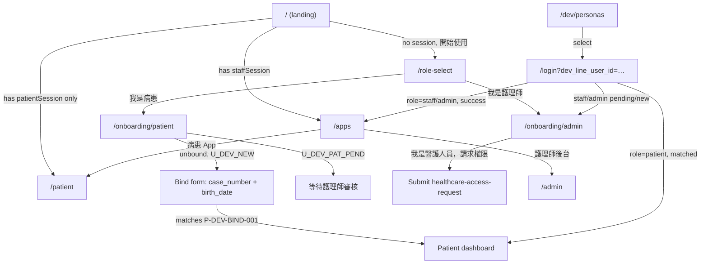

# Local verification without LINE

Verify login/onboarding for every role (new user, patient, staff, admin, dual-role)
without a real LINE account or LIFF app.

Host app processes (`npm run dev`) talk to Compose infra (`npm run dev:infra`) using
`127.0.0.1`. Auth uses a paired stub:

- **Frontend LIFF bypass** ([`apps/frontend/lib/auth/liff.ts`](../../apps/frontend/lib/auth/liff.ts)):
  when `NEXT_PUBLIC_LIFF_ID` is unset in development, login sends `stub:<line_user_id>`
  instead of a real LINE id token. Use [`/dev/personas`](../../apps/frontend/app/dev/personas/page.tsx)
  to pick a role.
- **Backend stub verification** ([`line_provider.py`](../../apps/backend/app/services/auth/line_provider.py)):
  when `LINE_VERIFY_MODE=stub`, the backend accepts only `stub:…` tokens.

This is **host-local only**. Production, staging, and Compose full-stack keep
`LINE_VERIFY_MODE=line` and a real `NEXT_PUBLIC_LIFF_ID`.

## Canonical path

```bash
# 1) Postgres + SeaweedFS (no frontend/backend containers)
npm run dev:infra

# 2) Host-oriented env (do this once)
cp apps/backend/.env.local.example apps/backend/.env
cp apps/frontend/.env.local.example apps/frontend/.env.local
# Ensure NEXT_PUBLIC_LIFF_ID is NOT set in apps/frontend/.env or .env.local

# 3) Seed personas (idempotent)
npm run seed:dev-personas

# 4) App processes on the host
npm run dev

# 5) Pick a role
open http://localhost:3000/dev/personas
```

- Frontend: `http://localhost:3000`
- Backend: `http://localhost:8000` (browser should use same-origin `/api`)
- Postgres: `127.0.0.1:5432`
- SeaweedFS S3: `http://127.0.0.1:8333`

## Remote dev on abbey (VPN)

On `abbey.lu.im.ntu.edu.tw`, use port **3010** (not 3000) so it does not collide with a laptop's local `:3000`:

```bash
npm run dev:abbey
# http://abbey.lu.im.ntu.edu.tw:3010/dev/personas
```

Equivalent: `FRONTEND_DEV_PORT=3010 npm run dev`. Frontend binds `0.0.0.0:3010`; backend stays on `:8000` (browser uses `/api` proxy).

## Switching personas

Prefer **http://localhost:3000/dev/personas** (clears sticky sessions and re-enters login).

Advanced: append `?dev_line_user_id=<ID>` yourself, e.g.
`http://localhost:3000/login?dev_line_user_id=U_DEV_ADMIN&next=/admin`.

## Dev personas

Seeded by [`seed_dev_personas.py`](../../apps/backend/sql/manual/seed_dev_personas.py)
(`npm run seed:dev-personas`).

| `line_user_id` | State | Exercises |
| --- | --- | --- |
| `U_DEV_NEW` | No `liff_identities` row | Landing → role-select → patient/admin onboarding |
| `U_DEV_PAT_PEND` | `patient`, inactive + `pending_bindings` | Patient "等待護理師審核" |
| `U_DEV_PAT_MATCH` | `patient`, matched to `P-DEV-MATCH-001` | Patient dashboard |
| `U_DEV_STAFF` | `staff`, active | `/apps` → admin shell |
| `U_DEV_ADMIN` | `admin`, active | `/apps` → `/admin` |
| `U_DEV_DUAL` | `admin` + matched patient | `/apps` shows both cards |

Bindable patient for `U_DEV_NEW`: `case_number=P-DEV-BIND-001`, `birth_date=1990-01-01`.

For richer staff grids, also run
`cd apps/backend && python sql/manual/seed_dev_fake_patients.py` after infra is up
(the root `npm run seed:dev-fake-patients` script targets K8s by default).

## Flow diagram



## Per-role verification checklist

- [ ] **New user**: `/dev/personas` → 新用戶 → confirm role-select / onboarding.
- [ ] **Patient pending**: 待審核病患 → `/patient` shows 等待護理師審核.
- [ ] **Patient bind success**: 新用戶 → bind `P-DEV-BIND-001` / `1990-01-01`.
- [ ] **Patient returning**: 已綁定病患 → `/patient` dashboard.
- [ ] **Staff/admin**: staff 或 admin → `/apps` → `/admin`.
- [ ] **Dual-role**: 雙重身分 → `/apps` shows both cards.

## Troubleshooting

- **Login stuck / LINE verify 400 on every persona (including 新用戶)**: a Compose
  `backend` container is often bound to `:8000` with `LINE_VERIFY_MODE=line`, while the
  host frontend proxies `/api` there. Stop it (`docker stop pd-care-backend-1`) and run
  host `npm run dev:backend` (or `npm run dev`) with `.env` from `.env.local.example`.
  `npm run dev:infra` must **not** start the backend container.
- **`DATABASE_URL` / S3 host `postgres` or `seaweedfs-s3` fails on host**: you copied
  `apps/backend/.env.example` (Compose hostnames). Use `.env.local.example` (`127.0.0.1`)
  and `npm run dev:infra`.
- **Login fails mentioning stub vs LINE**: FE and BE modes disagree. Backend must be
  `LINE_VERIFY_MODE=stub`; frontend must leave `NEXT_PUBLIC_LIFF_ID` unset (check `.env`
  and `.env.local`).
- **`/dev/personas` 404**: LIFF bypass inactive (LIFF id set, or not `next dev`).
- **API `ERR_CONNECTION_REFUSED` from a LAN IP**: use `NEXT_PUBLIC_API_BASE_URL=/api` +
  `BACKEND_INTERNAL_URL=http://127.0.0.1:8000` (see `.env.local.example`).
- **Persona data missing**: re-run `npm run seed:dev-personas`.
- **Frontend hangs compiling**: use webpack (`next dev --webpack`, already default);
  clear `apps/frontend/.next` and restart.
