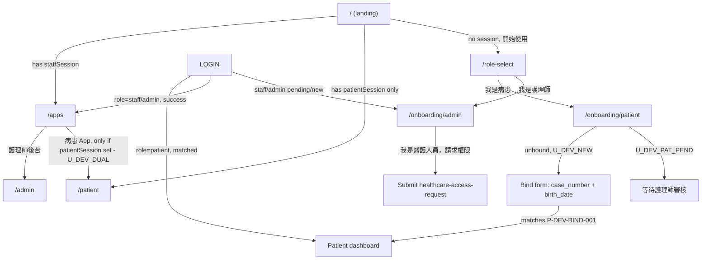

# Local verification without LINE

Verify the login/onboarding flow for every role (new user, patient, staff, admin, dual-role)
without a real LINE account or LIFF app. This works by pairing two existing dev-only mechanisms:

- **Frontend dev bypass** (`apps/frontend/lib/auth/liff.ts`): when `NEXT_PUBLIC_LIFF_ID` is unset
in development, `getLiffLoginProof()` skips the LIFF SDK entirely and returns a
`stub:<line_user_id>` id token for a LINE user id you choose.
- **Backend stub verification** (`apps/backend/app/services/auth/line_provider.py`): when
`LINE_VERIFY_MODE=stub`, the backend accepts `stub:<line_user_id>` tokens instead of calling
LINE's verify endpoint.

This is dev-only. Production and staging keep `LINE_VERIFY_MODE=line` and a real
`NEXT_PUBLIC_LIFF_ID` — never set `LINE_VERIFY_MODE=stub` outside local development.

## 1. Prerequisites

- Postgres reachable (Compose `docker compose up -d postgres`, or your local sqlite dev DB is fine
too — the seed script works with whatever `DATABASE_URL`/`PDCARE_DATABASE_URL` your backend uses).
- Repo dependencies installed (`npm install` at repo root; backend venv set up per
`[apps/backend/README.md](../../apps/backend/README.md)`).


## 2. One-time setup

1. Backend: copy the stub override into your `apps/backend/.env` (or merge
  `[apps/backend/.env.stub.example](../../apps/backend/.env.stub.example)` into it):
2. Frontend: copy `[apps/frontend/.env.local.example](../../apps/frontend/.env.local.example)` to
  `apps/frontend/.env.local`. **Do not** set `NEXT_PUBLIC_LIFF_ID` there — leaving it unset (and
   not inherited from `.env`) is what activates the dev bypass.
3. Seed the canonical dev personas:
  ```bash
   npm run seed:dev-personas
  ```
   This prints a persona table with the `?dev_line_user_id=` value for each row.
4. Start the stack: `npm run dev` (or `npm run dev:frontend` + `npm run dev:backend` separately).
  The frontend dev script uses webpack (`next dev --webpack`) to avoid Turbopack module-resolution
   issues in this monorepo layout.


## 3. Switching personas

Sessions are cached in `localStorage`, so switching personas requires clearing the old session
before picking a new dev user. Either:

- Append `?dev_line_user_id=<ID>` to any URL (e.g. `http://localhost:3000/login?dev_line_user_id=U_DEV_ADMIN&next=/admin`), **or**
- Run in the browser console:
  ```js
  localStorage.removeItem("pdCare.staffSession");
  localStorage.removeItem("pdCare.patientSession");
  localStorage.setItem("pdCare.devLineUserId", "U_DEV_ADMIN");
  ```

Then navigate to `/` (or `/login`) to re-trigger login with the new persona.

## 4. Dev personas

Seeded by `[apps/backend/sql/manual/seed_dev_personas.py](../../apps/backend/sql/manual/seed_dev_personas.py)`
(`npm run seed:dev-personas`). All IDs use the `U_` prefix required by backend LINE user ID
validation (`^U[A-Za-z0-9_-]{5,127}$`).


| `line_user_id`        | State                                    | Exercises                                                    |
| --------------------- | ---------------------------------------- | ------------------------------------------------------------ |
| *(unset)* `U_DEV_NEW` | No `liff_identities` row                 | Landing → role-select → patient/admin onboarding |
| `U_DEV_PAT_PEND`      | `patient`, inactive + `pending_bindings` | Patient "等待護理師審核" screen                                     |
| `U_DEV_PAT_MATCH`     | `patient`, matched to `P-DEV-MATCH-001`  | Patient dashboard after login                                |
| `U_DEV_STAFF`         | `staff`, active                          | Staff login → `/apps` (admin card only)                      |
| `U_DEV_ADMIN`         | `admin`, active                          | Admin login → `/apps` → `/admin`                             |
| `U_DEV_DUAL`          | `admin`, active + matched patient        | `/apps` shows both admin and patient cards                   |


A bindable patient with no identity (`case_number=P-DEV-BIND-001`, `birth_date=1990-01-01`) is
also seeded for testing a successful bind as `U_DEV_NEW`.

## 5. Flow diagram




## 6. Per-role verification checklist

- [ ] **New user landing + role-select**: clear sessions, unset `?dev_line_user_id=` (or use an
  ```
  ID with no seeded row), visit `/`. Confirm intro copy + "開始使用" renders, and it routes to
  `/role-select`.
  ```
- [ ] **Patient bind — pending**: `?dev_line_user_id=U_DEV_PAT_PEND`, visit `/patient`. Confirm
  ```
  "等待護理師審核" screen.
  ```
- [ ] **Patient bind — success**: `?dev_line_user_id=U_DEV_NEW`, visit `/patient`, submit the bind
  ```
  form with `case_number=P-DEV-BIND-001`, `birth_date=1990-01-01`. Confirm it transitions to
  the matched dashboard.
  ```
- [x] **Patient returning session**: `?dev_line_user_id=U_DEV_PAT_MATCH`, visit `/`. Confirm
  ```
  auto-redirect to `/patient` dashboard (no bind form).
  ```
- [ ] **Staff onboarding request**: `?dev_line_user_id=U_DEV_NEW`, visit `/login?next=/admin`.
  ```
  Confirm redirect to `/onboarding/admin`, then submit "我是醫護人員，請求權限" and confirm the
  pending-request state persists on reload.
  ```
- [ ] **Staff/admin login →** `/apps` **→** `/admin`: `?dev_line_user_id=U_DEV_STAFF` (or
  ```
  `U_DEV_ADMIN`), visit `/login?next=/apps`. Confirm `/apps` shows only the 護理師後台 card,
  and clicking it reaches `/admin`.
  ```
- [ ] **Dual-role** `/apps` **both cards**: `?dev_line_user_id=U_DEV_DUAL`, visit `/login?next=/apps`.
  ```
  Confirm `/apps` shows both 護理師後台 and 病患 App cards.
  ```


## 7. Troubleshooting

- **API calls fail / `ERR_CONNECTION_REFUSED`**: if you open the frontend via a network IP
  (e.g. `http://140.112.x.x:3000` from another machine), do **not** set
  `NEXT_PUBLIC_API_BASE_URL=http://127.0.0.1:8000` — the browser will call *your laptop's*
  localhost. Use the same-origin proxy instead: `NEXT_PUBLIC_API_BASE_URL=/api` plus
  `BACKEND_INTERNAL_URL=http://127.0.0.1:8000` (see `.env.local.example`). Restart
  `npm run dev` after changing env.
- **API calls fail / CORS errors**: with direct backend URLs, confirm host/port matches and CORS
  allows your frontend origin; prefer `/api` proxy for local dev.
- **Login always fails with a real-LINE-shaped error**: you probably forgot
`LINE_VERIFY_MODE=stub` in `apps/backend/.env`, or `NEXT_PUBLIC_LIFF_ID` is still set somewhere
frontend-side (check both `.env` and `.env.local`).
- **Persona doesn't behave as expected**: sessions are sticky in `localStorage`; clear
`pdCare.staffSession` / `pdCare.patientSession` before switching personas (Section 3).
- **Persona data looks stale or missing**: re-run `npm run seed:dev-personas` — it's idempotent
and safe to run repeatedly.
- **Frontend hangs on "compiling"**: if Turbopack loops on missing modules, use webpack dev mode
(`next dev --webpack`, already the default in `apps/frontend/package.json`). Clear
`apps/frontend/.next` and restart `npm run dev`.

