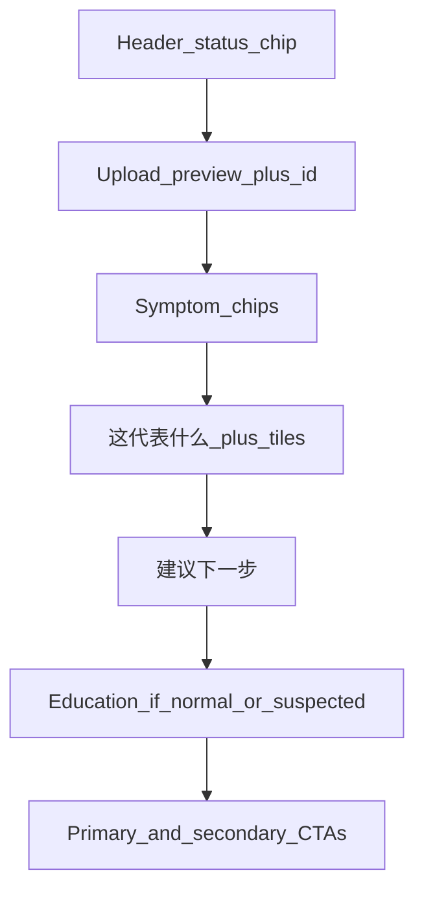

# Patient Result Page Redesign Implementation Plan

> **For agentic workers:** REQUIRED SUB-SKILL: Use superpowers:subagent-driven-development (recommended) or superpowers:executing-plans to implement this plan task-by-task.

**Goal:** Rebuild the patient `/patient/result` page to the approved quiet v6 layout while preserving clinical behavior.

**Architecture:** Keep `getPatientUploadResult` hydration + query fallbacks; add display-only elevated chrome; load preview via `fetchPatientUploadDetail`.

**Tech Stack:** Next.js client page, Tailwind, lucide-react, `@/lib/symptoms`, `@/lib/api/upload-history`.

I'm using the **writing-plans** skill to create this implementation plan from the approved companion design (C → v6).

**Goal:** Rebuild the patient `/patient/result` page to the approved quiet, assignment-page-like layout while preserving clinical behavior (symptom-elevated chrome, education links, durable hydration).

**Architecture:** Keep existing data flow (`getPatientUploadResult` + query-string fallbacks + `isSymptomElevatedFromNormal`). Restructure presentation only. Load preview image via existing `fetchPatientUploadDetail(uploadId)` when `uploadId` is available (same pattern as [`app/patient/uploads/[uploadId]/page.tsx`](apps/frontend/app/patient/uploads/[uploadId]/page.tsx)).

**Tech stack:** Next.js client page, Tailwind, lucide-react, existing `@/lib/symptoms` helpers, `fetchPatientUploadDetail` from `@/lib/api/upload-history`.

## Locked design (v6)

Page order:

1. Header: `分析結果` + timestamp + status chip (not a giant hero card)
2. Upload preview (4:3, `rounded-xl`, zinc border) with **always-visible** `上傳 #N` top-right label when `uploadId` exists
3. `本次症狀紀錄` chips under preview (`gap-2` / 8px between badges); empty → `無症狀回報`
4. `這代表什麼` narrative + signal tile(s)
5. `建議下一步` advisory block (seek-care copy for suspected/elevated; routine copy for normal)
6. Education block (nurse-required) — emerald on normal, red on suspected/elevated; **omit** for rejected / technical_error
7. Primary CTA + secondary links + medical disclaimer

Signal tiles:

- Rounded-square color badge **after** the title (`影像模型` / `症狀綜合`)
- Green square = reassuring; orange = elevated symptom risk; amber/zinc for rejected/error as needed
- Confidence as muted `(N%)` after the **影像模型** verdict only (not a separate meta row)
- Dual tiles only when symptom-elevated (`normal` image + high-risk symptoms); true AI `suspected` uses single suspected narrative without the dual strip unless elevated logic applies; normal uses single 影像模型 tile

CTAs (unchanged intent):

- Suspected / elevated: seek-care is **copy-only** (no new contact button); primary nav CTA = 回到追蹤日曆
- Normal: primary = 回到追蹤日曆
- Rejected / technical_error: primary = 重新拍攝; keep calendar/home secondary as today
- Keep 「查看本次上傳明細」 when `uploadId` present
- Deduplicate today’s redundant dual “home/calendar” links into one primary + one secondary where possible

## Files

| File | Role |
| --- | --- |
| [`docs/superpowers/specs/2026-07-17-patient-result-page-redesign-design.md`](docs/superpowers/specs/2026-07-17-patient-result-page-redesign-design.md) | Write approved design (supersedes visual parts of older elevated-only spec; keep API constraint: do not mutate `screening_result`) |
| [`docs/superpowers/plans/2026-07-17-patient-result-page-redesign.md`](docs/superpowers/plans/2026-07-17-patient-result-page-redesign.md) | Persist this plan on disk during execution |
| [`apps/frontend/app/patient/result/page.tsx`](apps/frontend/app/patient/result/page.tsx) | Main UI rewrite |
| [`apps/frontend/app/patient/result/__tests__/page.test.tsx`](apps/frontend/app/patient/result/__tests__/page.test.tsx) | New focused tests (page currently has none) |
| [`docs/product/curated-prd.md`](docs/product/curated-prd.md) | Brief note that result page layout is explain-then-act with preview + education preserved |

No backend/API changes.

## Implementation tasks

### 1. Spec + plan docs
- Write design spec capturing v6 layout, states (normal / suspected / elevated / rejected / technical_error), education rules, always-visible upload label, and non-goals (no contact deep-link, no API mutation).
- Save the implementation plan under `docs/superpowers/plans/`.

### 2. Tests first (result page)
Add `__tests__/page.test.tsx` covering:
- Elevated: status chip suspected, dual tiles with square badges, confidence after 影像模型 as `(N%)`, education red block present, symptoms under preview
- Normal: emerald education, single model tile, calendar primary CTA
- Rejected: retake CTA, no education
- Preview: when `uploadId` present, `fetchPatientUploadDetail` called and image rendered; upload `#` label visible
- Meta: no standalone 確信度 / 紀錄編號 card rows

Mock `getPatientUploadResult`, `fetchPatientUploadDetail`, session, and `useSearchParams`.

### 3. Implement layout in `result/page.tsx`
- Replace stacked colored hero cards with quiet zinc structure matching assignment page chrome
- Wire preview fetch when `uploadId` is set; hide preview (or show empty rounded frame without id) when no durable upload id / fetch fails — do not block the rest of the page
- Preserve existing hydration, elevated logic, education URLs (`EDUCATION_MATERIALS`), and disclaimer copy
- Keep Chinese clinical copy; only restructure presentation and consolidate CTAs

### 4. PRD touch-up + verify
- Update curated PRD bullet for patient result presentation
- Run focused frontend test for the new file; fix lint on touched files

## Out of scope
- Backend result payload changes
- New contact / LINE / phone CTAs
- Redesigning upload detail or day pages
- Changing `screening_result` semantics
