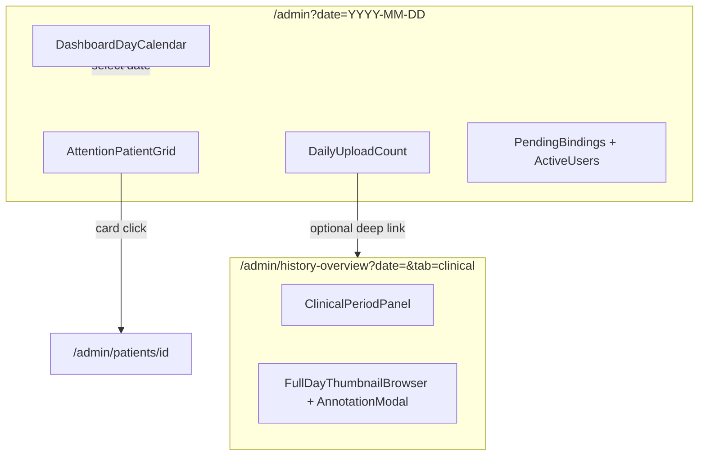

# Admin daily workbench v2 (儀表板)

**Date:** 2026-07-25  
**Status:** Approved (design locked via companion v16)  
**Companion:** `.superpowers/brainstorm/1648867-1784983471/content/admin-dashboard-final-overall-v16-metrics-gap.html`  
**Supersedes (homepage IA):** parts of `2026-07-25-admin-dashboard-homepage-renovate-design.md` that conflict with date-selectable dashboard and removal of homepage thumb grid.

## Problem

v1 `/admin` is a today-only workbench. Staff cannot review a past Taipei day without leaving the homepage for history-overview’s risk-colored calendar. Patient rows are horizontal with tier badge pills; risk patients lack a clear “highest risk” hero; homepage still shows a recent-upload thumb wall that duplicates the patient pool.

## Goals

1. Make `/admin` a **date-selectable 儀表板** (`?date=YYYY-MM-DD`, default today Taipei).
2. Move metric month calendar onto the homepage (full-width cells with upload / users / risk chips).
3. Redesign patient pool as vertical cards with avatar + day upload count + risk hero or preview thumbs.
4. Keep full-day thumbnail review + annotation on `/admin/history-overview?tab=clinical`.
5. Remove homepage `RecentUploadThumbs`.

## Non-goals

- Renaming `/v1/staff/uploads/today-attention`.
- Inline annotation modal on `/admin`.
- Homepage upload thumb grid.
- Date filter on upload queue endpoint.
- Mass rename of `Today*` component filenames.

## Information architecture

| Surface | Role |
| --- | --- |
| `/admin?date=` | **儀表板** — metric calendar + attention pool + light ops |
| `/admin/history-overview?date=&tab=clinical` | **區間分析** — period KPIs + full day browser + annotation |
| `/admin/history-overview?tab=usage` | Usage trends (unchanged) |

### Date scope

| Widget | Follows `selectedDate` |
| --- | --- |
| Metric calendar, patient pool, upload count | Yes |
| Pending bindings, last-7-day active uploaders | No |
| Clinical period KPIs / charts | No (period dimension) |
| History-overview day browser | Yes (from URL `date`) |

### Naming & copy

- Sidebar + page h1: **儀表板**
- Subtitle uses **今日** vs **當日** based on whether `selectedDate` is Taipei today

## Calendar cell (v16 locked)

- Section: `rounded-2xl border border-zinc-200 bg-white p-5`
- Grid: `grid-cols-7 gap-2 w-full` (no max-width)
- Cell: `flex flex-col min-h-[96px] rounded-xl bg-zinc-50 p-2.5 min-w-0`; selected `bg-white ring-2 ring-zinc-900`
- Date row (top): day number `text-[13px]` + optional `尚有 {n} 未處理` `text-[9px] text-rose-400`
- Metrics row (bottom): `mt-auto pt-2` + `grid grid-cols-3 gap-1`
- Chips: Lucide `Image` / `Users` / `TriangleAlert`; icon above, number below; risk >0 red, =0 muted zinc
- No badge dots; no whole-cell risk tint; days without uploads dashed + disabled

**Unhandled definition:** patient tier is `suspected` or `elevated` and the representative upload has no staff annotation.

**Calendar API fields per day:** `upload_count`, `uploaded_users`, `risky_patient_count`, `unhandled_patient_count`

## Patient pool cards (v2 locked)

- Vertical card; whole card links to `/admin/patients/[id]`
- Top: LINE `PersonAvatar` + name; one-line subline `當日 N 張上傳 · status`
- Status colors: 未處理 `text-red-600` / 已註解 `text-green-600` / 今日已上傳 `text-zinc-500`
- No tier badge pills; annotated cards are **not** dimmed
- Multi-column: `grid-cols-1 lg:grid-cols-2 xl:grid-cols-3`

### Risk tiers (`suspected` / `elevated`)

- Hero row only (`h-14`): `[highest-risk thumb | metadata]`
- Hero pick: day’s non-rejected uploads by `_risk_rank` desc, then `probability` desc, then `created_at` asc
- Metadata (zinc text only): `最高風險 · HH:mm` → main line → optional symptom subline

### Other tier

- Plain thumb row `h-14`; show ≤4 or 3 + `+n`
- Backend returns up to 3 `preview_upload_ids` (created_at asc); FE derives `+n` from `day_upload_count`

### Attention API extensions

`StaffTodayAttentionPatientItem` adds:

- `picture_url`
- `day_upload_count`
- `preview_upload_ids` (other tier only)
- `risk_highlight` (risk tiers only): upload id, screening/probability/threshold, symptoms, `created_at`

`GET /v1/staff/uploads/today-attention` accepts optional `local_date=YYYY-MM-DD`.

## History-overview changes

- Read `?date=` and `?tab=` from URL; sync via `router.replace`
- Remove embedded risk-colored month calendar
- Keep day prev/next, period panel, KPI, grouping, thumb wall, annotation modal
- Add link back: `在儀表板變更日期 → /admin?date=…`

## Deep links

- Full day review: `/admin/history-overview?date=YYYY-MM-DD&tab=clinical`
- Optional: upload-count card links to the same day on history-overview
