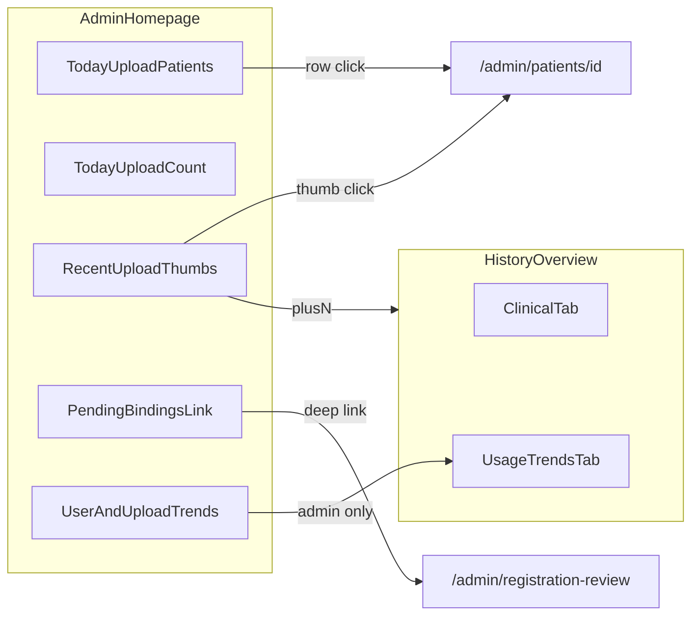

# Admin dashboard homepage renovate

**Date:** 2026-07-25  
**Status:** Approved, amended 2026-08-18  
**Companion session:** `.superpowers/brainstorm/1424761-1784972892/`

**Amendment (2026-08-18):** `/admin` again shows compact **用戶趨勢** + **上傳數趨勢** Recharts above the calendar. These reuse the history-overview chart components. They are **admin-only** and mount after the today workbench request so staff do not hit analytics APIs and workbench latency stays first. History-overview 使用趨勢 remains the full usage surface (independent lookbacks, suspected-ratio series). Do **not** remove the homepage charts to restore the original 2026-07-25 IA.

## Problem

`/admin` mixes informative but weakly actionable metrics (period KPIs, active-user charts, daily suspected series) with operational queues. Staff cannot quickly answer: how many patients need attention, who is most urgent, and what to do next. Visual language is denser and noisier than `/admin/patient-assignment`.

## Goals

1. Split **today workbench** from **period analytics**.
2. Make the homepage patient-centric and actionable.
3. Separate **clinical** vs **system/usage** presentation.
4. Restyle to quiet zinc chrome aligned with patient-assignment (full UI redo, not card polish).

## Non-goals

- Changing `/admin/monitoring` (Grafana / infra).
- Redesigning patient-assignment, review-fast, or registration-review pages (homepage only deep-links into them).
- Adding overdue-compliance (N days without upload) in v1.
- Keeping suspected-infection **notifications panel** on the homepage (removed from this surface).

## Information architecture

| Surface | Role |
| --- | --- |
| `/admin` | **今日工作台** — triage + light ops |
| `/admin/history-overview` | **區間分析** — clinical period KPIs + day browser + usage trends |
| `/admin/monitoring` | System observability (unchanged) |

Homepage period chips / risk-composition Recharts move off `/admin` into `history-overview`. Compact user + upload trend charts stay on `/admin` for admins (2026-08-18 amendment).

## Metric taxonomy

### Clinical — today (`/admin`)

| Metric | Definition | Action |
| --- | --- | --- |
| 今日疑似病患數 | Distinct patients with ≥1 **suspected** upload today (Taipei day) | Hero tier count |
| 今日高風險病患數 | Distinct patients with ≥1 **elevated** and **no** suspected today | Hero tier count |
| 今日其餘上傳病患數 | Distinct patients with ≥1 non-rejected upload today who are in neither tier above | Hero tier count |
| 今日上傳病患列表 | Union of the three tiers (same set as hero) | Primary triage list |
| 今日上傳次數 | Non-rejected upload count today | Scalar support |
| 最新上傳縮圖 | Recent uploads with risk badge + time | Browse → patient; `+n` → history-overview |
| 待審綁定 | Pending LINE↔patient bindings (count + summary rows) | Deep link to registration-review |

**Removed from homepage (v1 renovate):** unread notification panel; period filters; risk pie/bar; “篩選病患數” as a homepage hero KPI.

**Restored (2026-08-18):** compact active/bound-user trend + upload-count trend (admin-only, above the calendar).

### Clinical — period (`history-overview` → 臨床 tab)

| Metric / block | Notes |
| --- | --- |
| Period chips (months / range) | Moved from homepage |
| Suspected / elevated patient counts | Period window |
| Upload count | Period window |
| Registered / filtered patient count | Scale |
| Risk composition chart | From homepage |
| Existing calendar + thumbnail browser | Keep / integrate |

### System / usage (`history-overview` → 使用趨勢 tab; homepage compact charts for admin)

| Metric | Where |
| --- | --- |
| Active uploaders + bound LINE identities series | Usage tab; compact copy on `/admin` (admin-only) |
| Daily upload series | Usage tab; compact copy on `/admin` (admin-only) |
| Daily suspected / elevated series | Usage tab only |

Infra metrics stay on `/admin/monitoring`.

## Today list rules

### Membership

List = all distinct patients with ≥1 non-rejected upload **today** (Taipei), scoped by existing staff assignment rules (staff see assigned patients; admin see accessible set).

Hero counts are a partition of that same set into three tiers:

1. **suspected**
2. **elevated** (elevated uploads, no suspected in window)
3. **other** (today uploads, neither of the above)

### Sort

1. Tier: suspected → elevated → other  
2. Within tier: **earlier** qualifying upload time first (longer wait = higher priority)  
3. Stable tie-break: patient id

### Row content (design C + single thumb A)

- Small representative thumbnail (not large)
- Patient name + tier badge（疑似 / 高風險 / 今日上傳）
- Subline status:
  - suspected / elevated: **已註解** iff the **representative** risk upload has a staff annotation; otherwise **未處理**; show wait-from time for that representative upload
  - other: **今日已上傳** (no annotation gate)
- Trailing `開啟 →`
- Annotated risk rows may be visually de-emphasized (opacity)

### Representative thumbnail

- Risk tiers: the upload used for sort priority (highest severity, then earliest)
- Other tier: latest today upload
- Thumbnails only need preview for the representative upload (small square, history-overview visual language at reduced size)

### Click

Entire row (including thumb) → `/admin/patients/[id]`

## Homepage layout

### Desktop — Layout B (left / right board)

- Quiet header: title + one-line helper (patient-assignment tone)
- **Left (primary):** dashed pool section「今日上傳病患」with hero tier counts in header + sorted rows
- **Right (stacked, no tabs):**
  1. 今日上傳次數 scalar
  2. 最新上傳 — compact thumbnail grid (history-overview style: risk badge + time), ~5 visible + `+n` overflow cell
  3. 待審綁定 — summary rows + deep link to registration-review (no full inline approve/link/create/reject on homepage)
  4. Compact 用戶趨勢 + 上傳數趨勢 (admin-only; 2026-08-18)

### Mobile

Single column: list first, then the same right-stack blocks.

### Visual language

Align with patient-assignment:

- `bg-zinc-50` page, white panels, `rounded-xl`, zinc borders
- Dashed pool for the primary work list
- Compact controls, muted empty/loading copy
- Cards only as interaction containers
- No metric-soup KPI wall; no notification panel

## Upload thumb grid

- Same interaction language as history-overview thumbnails, smaller cells
- Only recent N uploads; overflow shows `+n` (assignment-lot style), not infinite “load more” on the homepage
- Thumb click → `/admin/patients/[id]` (not modal)
- `+n` → `/admin/history-overview` (today / default clinical view)
- Header link may still point to 極速審核 as secondary egress

## Pending bindings

- Homepage shows count + compact summary (case number / birth date / candidate hint)
- Primary action: navigate to `/admin/registration-review`
- Do **not** port the full inline binding workspace onto the homepage in this redesign

## Notifications

- Remove homepage「疑似感染通知」panel from this renovate
- Admin layout notification bell may remain unchanged unless a follow-up explicitly removes it

## History-overview renovate

### Tabs

1. **臨床** — period KPIs (suspected/elevated patients, uploads, patient scale) + risk composition chart + existing calendar/thumbnail browser  
2. **使用趨勢** — active uploaders series + daily upload/suspected series (moved from homepage)

Period controls live on this page (not homepage).

Visual chrome should move toward the same quiet zinc language where touched; full pixel rewrite of every history control is not required in v1 if structure/tabs land cleanly, but new KPI/chart sections should match homepage tokens.

## Backend / API implications

Likely need a **today attention / today uploaders** endpoint (or extend suspected summary) that returns:

- tier counts (suspected, elevated, other)
- ordered patient rows with: patient identity, tier, representative upload id + image access, sort timestamp, annotation-handled flag (for risk tiers)

Reuse existing:

- upload queue (limit for thumb grid)
- pending bindings list (summary only on FE)
- active-users series (homepage compact charts + usage tab)
- period suspected summary + chart series (history-overview)

Exact shapes are implementation-plan details; this spec locks product semantics above.

## RBAC

- Preserve current rules: staff assignment-scoped lists; admin analytics where already admin-gated
- Homepage today list must respect the same visibility as current staff patient/upload queues
- History-overview admin-only charts remain admin-gated if that is current behavior

## Success criteria

- Staff can open `/admin` and within one viewport see who to handle first (risk-first, oldest first) with handled state visible for risk rows
- Counts answer “how many patients” by tier, not only “how many uploads”
- Period/trend detail (risk composition, independent lookbacks, suspected series) stays on history-overview
- Visual density comparable to patient-assignment; no notification panel; no three-column metric soup

## Open follow-ups (out of v1)

- Overdue non-uploaders (compliance)
- Notification bell / global notification UX cleanup
- Inline binding actions on homepage
- Upload thumb → review-fast deep link
